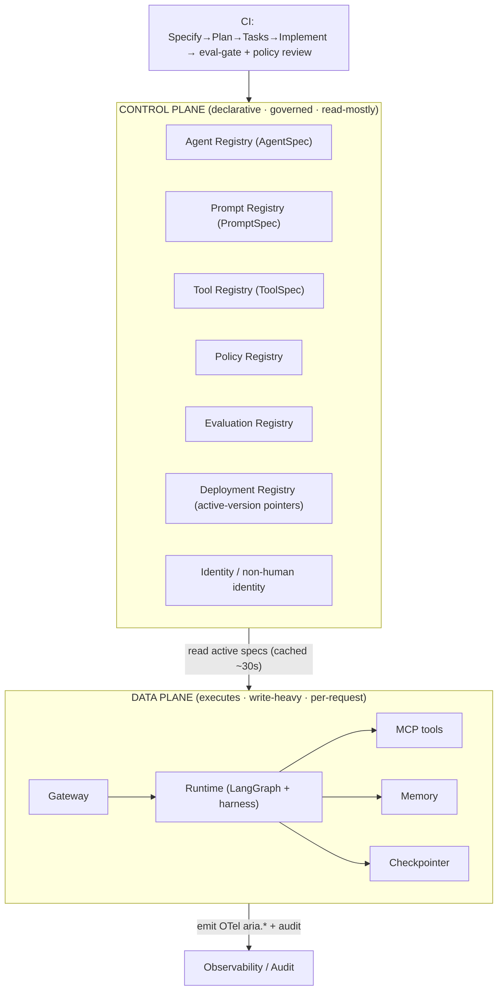

# Reference Architecture — Control-plane / Data-plane Split (domain A·1)

> **Status:** v1 reference · **Family:** A · Architecture backbone · **Tier:** CORE
> **Owning phase:** P0 (thin registry) → P1 (full split). **The spine everything hangs on.**
>
> **Research update (live-verified June 2026):** Forrester formally defined the "agent control
> plane" category (Dec 2025) as infrastructure that *"inventories, governs, orchestrates, and
> assures heterogeneous AI agents across vendors and domains."* Forrester's **three-plane model**
> (Build · Orchestration · Control) is now the industry reference — warning: *"Enterprises that
> conflate build-time, orchestration-time, and runtime governance into a single undifferentiated
> function will face expensive architectural refactoring."*
>
> All three major clouds shipped agent registries in **April 2026**:
> - **AWS Bedrock AgentCore Registry** — governed metadata service with `draft → pending →
>   approved` lifecycle, EventBridge state-transition events for CI/CD integration, URL-based
>   automatic ingestion from live MCP/A2A endpoints, approval workflow with per-registry IAM/JWT
>   auth. Registry itself exposes an **MCP endpoint** (an AI agent can query the registry via
>   MCP). Stores: name, capabilities, protocols, ownership, compliance status, cost center,
>   publisher identity, version history.
>   [Source: AWS Agent Registry Docs](https://docs.aws.amazon.com/bedrock-agentcore/latest/devguide/registry.html)
> - **LangSmith Deployment (Hybrid tier)** — the exact ARIA P1 pattern: SaaS **control plane**
>   (deployment lifecycle, image spec, env vars, tracing setup, agent registry as "Assistants") +
>   self-hosted **data plane** (Kubernetes listeners running LangGraph Server — task queues,
>   streaming, durable execution). Assistants are versioned config objects: each update creates a
>   numbered version; any version can be promoted active; multiple Assistants on the same Graph
>   run simultaneously (A/B testing without infra duplication).
>   [Source: LangSmith Control Plane Docs](https://docs.langchain.com/langsmith/deploy-with-control-plane)
> - **Microsoft Agent 365** (GA April 2026, replaced Entra Agent Registry) — agents as
>   non-human Entra identities; risk signals from Defender/Purview surfaced per-agent; managed
>   via Microsoft Graph API (`GET /packages`).
>   [Source: Microsoft Learn Agent Registry](https://learn.microsoft.com/en-us/microsoft-365/admin/manage/agent-registry)
>
> **ARIA P1 builds Option A** (separate control-plane FastAPI service) — the production-identical
> pattern proven by AWS/LangSmith, at laptop scale on k3d.

## 1. Purpose
Separate **what is declared and governed** (control plane: registries, policy, versions — changes
via deploy, read-mostly at runtime) from **where work executes** (data plane: gateway, lanes,
workers, runtime, tools, memory, checkpointer — write-heavy, per-request). Without this split,
versioning/rollback/policy/eval have nowhere to live, and you "can't reproduce, can't audit,
can't compare releases."

## 2. Architecture

## 3. Coverage
- **Six registries** (control plane): agent · prompt · tool · policy · evaluation · deployment.
- **Promotion flow**: spec change → CI (eval-gate + policy/security review) → registry → data
  plane pulls the new *active version* on its next cache refresh.
- **Read path**: runtime resolves `agent@active` (or a pinned version) from cache; control-plane
  outage degrades to last-known-good cached specs, not an outage.

## 4. Metrics & thresholds
| Metric | Meaning | Target/anchor |
|---|---|---|
| spec-propagation time | control-plane change → live in data plane | ≤ **30s** (cache refresh) |
| registry read latency | runtime resolving a spec | sub-ms (in-proc cache); ms (cold) |
| config drift | running version ≠ declared active | **0** unintended (GitOps drift induced *deliberately* only — C5) |
| rollback time | revert active pointer → effective | **< 60s** |
| promotion-gate pass rate | CI gate health | tracked; sudden drop = pipeline issue |

## 5. Key interfaces (the seam → contracts pass)
- **`AgentSpec` / `PromptSpec` / `ToolSpec`** — the frozen declarative schemas (designed in the
  contracts pass; consumed by every phase).
  - **P0 frozen subset** (implemented in `aria/contracts/agent_spec.py`):
    `AgentSpec(name, version, model, tools, max_steps, max_wall_clock_s, max_cost_micros, hitl_policy)`
  - **P1 additions**: `memory_scope` (namespaced memory plane), `alv`/`ppv`/`mrv`/`tav` version
    labels for the 4-layer versioning model (§9)
  - **P2 additions**: `eval_set_id` (gates model/prompt changes via the eval plane)
- **Active-version pointer** `(agent_name → version)` with atomic flip + history (rollback).
- **Registry read API** (cached, read-mostly).

## 6. Failure modes + how we break it (C5)
- **Control-plane down** → data plane runs on cached specs (degrade, not fail). *Break:* stop the
  registry, show runs continue on cache.
- **Stale cache** → bounded by refresh TTL; staleness metric alerts.
- **Bad spec promoted** → caught by the eval-gate (P2) before active flip.
- **Deliberate drift** (running ≠ declared) → the GitOps reconciliation lesson (consume Argo from
  infra-mastery/04); induced on command, never accidental.

## 7. SLO linkage + phase
Enables versioning, rollback, reproducibility → underpins *all* SLOs indirectly. Thin registry in
**P0**; full six-registry split + CI promotion in **P1**.

## 8. v1 caveats + P1 update
- ~~Registry storage = Postgres tables; not a bespoke service in v1.~~ **Superseded by P1:**
  ARIA P1 builds a real separate control-plane FastAPI service (`aria/control_plane/`) backed by
  Postgres — matching the LangSmith Hybrid pattern and AWS AgentCore modular services.
- "Deployment Registry" overlaps workflow/execution versioning (A3) — A1 owns *which version is
  active*, A3 owns *what happens to in-flight runs when active changes*.

## 9. Agent spec versioning in production (4 independent layers)
Production agent artifacts have **four independently versioned layers** (from AWS AgentOps research,
confirmed across platforms):
1. **ALV** — Agent Logic Version: reasoning architecture, orchestration code
2. **PPV** — Prompt & Policy Version: system prompts, guardrails, safety constraints
3. **MRV** — Model Runtime Version: specific model (e.g. `meta/llama-3.1-8b-instruct`)
4. **TAV** — Tool & API Interface Version: function schemas, endpoint versions

A complete production artifact identifier: `support-triage:ALV-1.0.0_PPV-1.0.0_MRV-llama-3.1-8b_TAV-1.0.0`

**Simultaneous version routing** (P3+):
- **AWS pattern:** ECR container images + endpoint **aliases** (DEV / PREPROD / PROD) — alias
  flip = instant rollback; two versions run simultaneously via different aliases.
- **LangGraph pattern:** Multiple Assistants on the same Graph run different configs
  simultaneously — A/B testing without infra duplication.
- **Shadow mode** (pre-canary): both versions receive requests; old serves users; new response
  logged for comparison — the standard pre-canary validation step for agents.
- **ARIA P1** introduces the ALV+MRV versioning in the registry; full canary/shadow → P2/P3.

[Source: AWS AgentOps Blog](https://aws.amazon.com/blogs/machine-learning/agentops-operationalize-agentic-ai-at-scale-with-amazon-bedrock-agentcore/)
[Source: Agent Versioning Patterns](https://medium.com/@nraman.n6/versioning-rollback-lifecycle-management-of-ai-agents-treating-intelligence-as-deployable-deac757e4dea)

## 10. Sources
- Forrester 3-plane model (Dec 2025): https://www.forrester.com/blogs/agent-control-planes-still-need-a-robust-standards-stack/
- Agent control-plane category battle (Apr 2026): https://siliconangle.com/2026/04/30/agentic-control-plane-battle-enterprise-ai-googlecloudnext/
- AWS Agent Registry docs (Apr 2026): https://docs.aws.amazon.com/bedrock-agentcore/latest/devguide/registry.html
- AWS Agent Registry preview announcement: https://aws.amazon.com/blogs/machine-learning/the-future-of-managing-agents-at-scale-aws-agent-registry-now-in-preview/
- AWS AgentOps / AgentCore: https://aws.amazon.com/blogs/machine-learning/agentops-operationalize-agentic-ai-at-scale-with-amazon-bedrock-agentcore/
- LangSmith Deployment GA (Oct 2025): https://www.langchain.com/blog/langgraph-platform-ga
- LangSmith control plane docs: https://docs.langchain.com/langsmith/deploy-with-control-plane
- LangSmith Assistants (versioned configs): https://docs.langchain.com/langsmith/assistants
- Microsoft Agent 365 (Apr 2026): https://learn.microsoft.com/en-us/microsoft-365/admin/manage/agent-registry
- Microsoft Entra Agent ID GA: https://www.bighatgroup.com/blog/entra-agent-id-ga-deep-dive/
- Control vs data plane: https://www.truefoundry.com/blog/control-plane-vs-data-plane
- 3 control-plane design patterns 2026: https://www.paulserban.eu/blog/post/architecting-the-ai-agent-control-plane-3-design-patterns-for-2026/
- Agent versioning (4-layer model): https://medium.com/@nraman.n6/versioning-rollback-lifecycle-management-of-ai-agents-treating-intelligence-as-deployable-deac757e4dea
