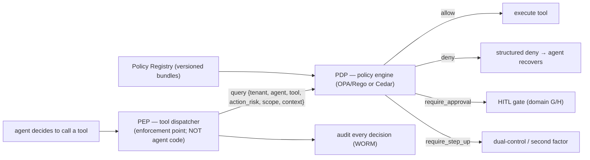

# Reference Architecture — Policy-as-Code (PDP) (domain A·2)

> **Status:** v1 reference · **Family:** A · Architecture backbone · **Tier:** CORE
> **Owning phase:** P1 (least-privilege) → P4 (full PDP + action-risk).
> **Research note:** the 2026 pattern is **runtime authorization** = a system built around a
> policy engine such that *"AI agents cannot commit actions without an explicit deterministic
> decision."* OPA/Rego and AWS Cedar are the engines; Microsoft's **Agent Governance Toolkit**
> (Agent OS, Apr 2026) is a stateless policy engine intercepting **every agent action before
> execution**, supporting YAML / OPA Rego / Cedar. [trigguard; permit.io; Microsoft OSS blog]

## 1. Purpose
One central, deterministic **Policy Decision Point (PDP)**: every side-effecting action asks
"allowed for this tenant / agent / scope / risk?" *before* it executes — instead of scattered
`if` checks. Auditable, testable, changeable in one place. The agent proposes; policy disposes.

## 2. Architecture

## 3. Coverage
Policies gate: **tool authorization** · **action gating by risk tier** (see A4) · **data
access + residency** · **rate/budget pre-checks** (links to Cost) · **content/safety policy**.
Decision outcomes: `allow · deny · require_approval · require_step_up`, each with *obligations*
(e.g., "log to regulated lane", "redact field X") and a human-readable *reason*.

## 4. Metrics & thresholds
| Metric | Meaning | Target/anchor |
|---|---|---|
| decision latency | PDP eval added per dispatch | sub-ms–low-ms (OPA in-proc); budget so it's invisible in SLO1 |
| policy coverage | % side-effecting dispatches gated | **100%** (ungated write path = bug) |
| decision-audit completeness | every decision logged | **100%** |
| policy test coverage | rules with adversarial tests | high; PDP is itself a tested artifact |
| fail-mode | engine-down behavior | **fail-closed** for write/critical; read may fail-open by policy |

## 5. Key interfaces (seam → contracts pass)
- **PDP request** `{tenant_id, agent_id, tool_id, action_risk, scope[], context}` →
  **decision** `{effect: allow|deny|require_approval|require_step_up, obligations[], reason}`.
- **Policy bundle** versioned in the Policy Registry (A1), content-hashed, promoted via CI with
  security review.
- Enforcement lives at the **tool dispatcher (PEP)**, never in agent code — so a hijacked agent
  cannot bypass what it doesn't control.

## 6. Failure modes + how we break it (C5)
- **Engine down** → fail-closed on write/critical (deny), fail-open only where policy explicitly
  allows for reads. *Break:* kill the PDP, show writes denied while reads degrade.
- **Bypass path** (a new code path skips the PEP) → enforce at dispatcher + allowlist of
  no-policy tools; bypass is impossible by construction, caught in review.
- **Over-permissive policy** → adversarial policy tests; deny-by-default for unknown actions.

## 7. SLO linkage + phase
**SLO5** (even a prompt-injected agent can only call granted tools) and **C8** (human gates).
Basic least-privilege grants in **P1**; full PDP + action-risk (A4) in **P4**.

## 8. v1 caveats
- Engine choice (OPA/Rego vs Cedar) decided at P4 against live docs (C10); leaning **OPA/Rego**
  (general-purpose, self-hostable, mature) unless Cedar's typed model wins for our schema.
- Policy authoring ergonomics (who writes Rego) is a DX concern → deferred.

## 9. Sources
- Runtime authorization vs policy engines: https://www.trigguardai.com/blog/runtime-authorization-vs-policy-engines
- OPA Rego vs Cedar: https://www.permit.io/blog/opa-vs-cedar
- Microsoft Agent Governance Toolkit (Agent OS, 2026): https://opensource.microsoft.com/blog/2026/04/02/introducing-the-agent-governance-toolkit-open-source-runtime-security-for-ai-agents/
- Runtime governance with OPA: https://gokhan-gokalp.com/runtime-governance-for-ai-agents-policy-as-code-with-opa/
