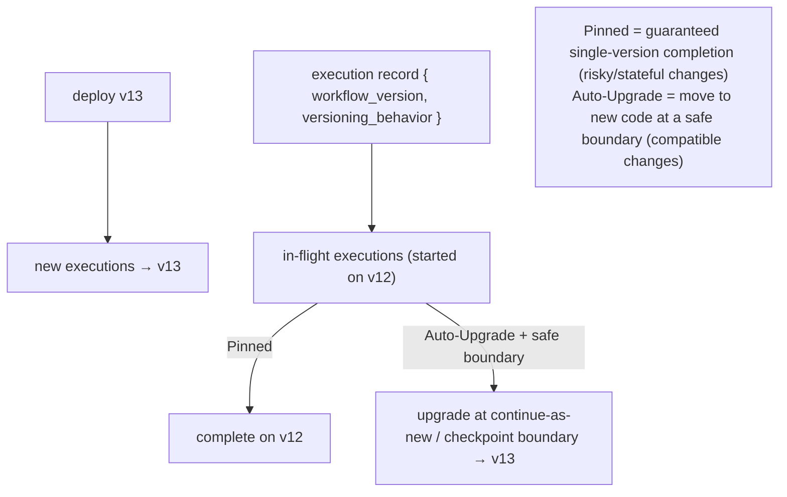

# Reference Architecture — Workflow / Execution Versioning (domain A·3)

> **Status:** v1 reference · **Family:** A · Architecture backbone · **Tier:** CORE
> **Owning phase:** P4. **The third sibling** of change-safety, distinct from AgentSpec
> versioning (A1, the *recipe*) and state-schema migration (D, the *data shape*).
> **Research note:** this is a solved pattern in durable-execution — **Temporal Worker
> Versioning** *"pins running Workflows to the Worker version that started them, so deploys never
> break in-flight executions,"* with per-type **Pinned vs Auto-Upgrade** behavior and
> **Upgrade-on-Continue-as-New** as the clean upgrade boundary. [Temporal docs + GA blog 2026]

## 1. Purpose
Deploy a new agent/workflow version **without breaking in-flight long-running executions**: v12
runs to completion while v13 takes new traffic. For 30-min–multi-day runs (SLO2), a deploy must
never corrupt a run that's mid-flight.

## 2. Architecture

## 3. Coverage
- **Versioning behavior per workflow type**: `Pinned` (guaranteed to finish on one version — for
  state-shape or non-deterministic changes) vs `Auto-Upgrade` (moves to new code at a safe point —
  for compatible changes).
- **Safe upgrade points**: continue-as-new / checkpoint boundaries (not mid-node).
- **Rollback of in-flight**: revert active version for *new* runs; pinned in-flight finish on old.
- **Relationship to checkpointer**: the version pin is read on resume, alongside the checkpoint.

## 4. Metrics & thresholds
| Metric | Meaning | Target/anchor |
|---|---|---|
| in-flight breakage on deploy | runs corrupted by a deploy | **0** (the whole point) |
| pinned-execution completion rate | pinned runs that finish cleanly | ~100% |
| version-skew window | how long retired versions linger (pinned long-runners) | bounded; alert if a pin outlives N days |
| rollback effectiveness | new runs on reverted version | < 60s (ties A1 rollback) |

## 5. Key interfaces (seam → contracts pass)
- **Execution record** carries `{workflow_version, versioning_behavior}`; resume reads the pin.
- **Versioning-behavior declaration** per workflow type (Pinned/Auto-Upgrade) in the spec.

## 6. Failure modes + how we break it (C5)
- **Deploy breaks in-flight** (the failure we prevent) → *break test:* deploy v13 mid-run, show a
  Pinned run completing untouched on v12.
- **Pinned long-runner stuck on retired version** → migrate via continue-as-new boundary; alert on
  long-lived pins.
- **Auto-Upgrade across a non-deterministic/state-shape change** → corruption → such changes MUST
  be Pinned (or gated by a state-schema migration, domain D).

## 7. SLO linkage + phase
**SLO2** (deep runs complete despite deploys). Built in **P4**. Per the charter, Temporal may be
layered for multi-day workflows (its Worker Versioning gives this for free); LangGraph-only runs
need explicit version-pin handling on resume.

## 8. v1 caveats
- LangGraph 1.2 has no first-class worker-versioning primitive (verify at P4 per C10); if we adopt
  Temporal for the long/ambient lane (P3), we inherit Pinned/Auto-Upgrade directly.
- Interaction with A1 active-version flip and D state-migration must be sequenced (migrate-then-flip).

## 9. Sources
- Temporal Worker Versioning (pin in-flight): https://docs.temporal.io/production-deployment/worker-deployments/worker-versioning
- Worker Versioning GA + Upgrade-on-Continue-as-New: https://temporal.io/blog/ga-worker-versioning-public-preview-upgrade-on-continue-as-new
- Updating running agent workflows without downtime: https://callsphere.ai/blog/workflow-versioning-migration-updating-running-agent-workflows
