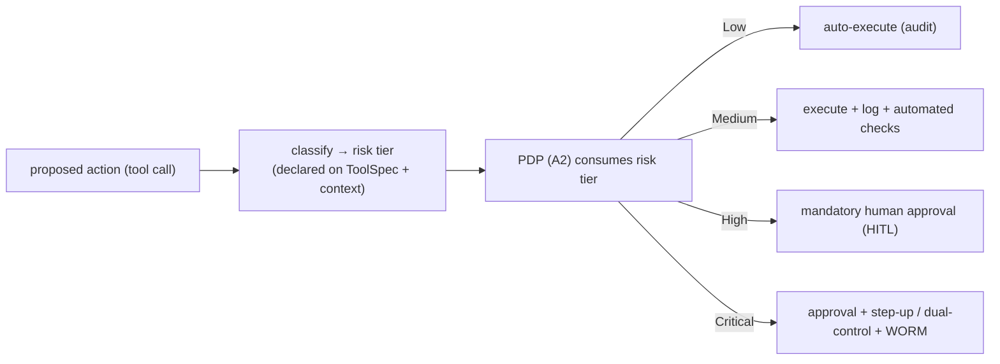

# Reference Architecture — Action-Risk Classification (domain A·4)

> **Status:** v1 reference · **Family:** A · Architecture backbone · **Tier:** CORE
> **Owning phase:** P4 (with policy-as-code). **The bridge** between policy-as-code (A2) and HITL.
> **Research note:** the 2026 standard governance pattern classifies agent actions by risk and
> maps risk → autonomy: *low* (read/summarize, minimal oversight), *medium* (send email, write
> DB — logging + automated checks), *high/critical* (financial txn, external comms, regulatory —
> human approval). **NIST** launched an autonomous-agent standards initiative Feb 2026; EU AI Act
> high-risk binds Aug 2026. [aimonk risk framework; covasant; McKinsey AI Trust 2026; NIST]

## 1. Purpose
A single **action-risk taxonomy** that classifies every action by blast radius / reversibility and
deterministically drives autonomy and approval. It's what turns policy-as-code from "allow/deny"
into "allow / log / require-human / require-dual-control."

## 2. Architecture

## 3. Coverage — the taxonomy (reversibility is the key axis)
| Tier | Examples | Autonomy | Audit |
|---|---|---|---|
| **Low** | read/summarize docs, get_customer | full autonomy | trace only |
| **Medium** | send internal email, create Jira, write scratch DB | conditional (log + automated checks) | logged |
| **High** | modify production DB, external comms, refunds | mandatory human approval | WORM |
| **Critical** | financial transfer, data deletion, regulatory action | approval + step-up / dual-control | WORM + evidence |

`reversibility` + `blast_radius` determine the tier; ambiguous → treated as the **higher** tier.

## 4. Metrics & thresholds
| Metric | Meaning | Target/anchor |
|---|---|---|
| classification coverage | % actions with a tier | **100%** (unclassified → treated Critical/deny) |
| Critical-without-approval | the cardinal sin | **0** incidents |
| approval rate by tier | High/Critical actually gated | High/Critical → ~100% gated |
| misclassification rate | wrong tier (audited) | low; quarterly reversibility audit |

## 5. Key interfaces (seam → contracts pass)
- **`ToolSpec.action_risk`** + `reversibility` + `blast_radius` declared per tool; classification
  feeds the **PDP request** (A2) and the **HITL trigger** (the interrupt contract).
- Tier→autonomy→audit mapping is a versioned policy artifact (Policy Registry, A1).

## 6. Failure modes + how we break it (C5)
- **Unclassified action** → defaults to most-restrictive (Critical/deny). *Break:* introduce a tool
  with no tier, show it's blocked.
- **Misclassified write as read** → reversibility audit + default-deny on ambiguity.
- **Risk-tier drift** as a tool's underlying API changes (a `get_*` that now writes) → tie tier to
  ToolSpec version; CI re-review on tool change (links to tool supply-chain, B).

## 7. SLO linkage + phase
**SLO5** + **C8** (human gates on high-blast-radius). Built in **P4** with policy-as-code; the
*Critical* lane wires into the regulated-lane WORM audit (compliance, H).

## 8. v1 caveats
- The exact tier boundaries are policy (tunable per tenant/regulated-lane), not hard-coded.
- Dynamic/context-dependent risk (same tool, higher risk for larger amounts) handled via PDP
  context, not just the static ToolSpec tier.

## 9. Sources
- Agentic risk framework (tiers → autonomy): https://aimonk.com/agentic-ai-security-governance/
- EU AI Act compliance for autonomous agents 2026: https://www.covasant.com/blogs/eu-ai-act-compliance-autonomous-agents-enterprise-2026
- McKinsey AI Trust 2026 (governance readiness): https://agentmarketcap.ai/blog/2026/04/07/mckinsey-ai-trust-2026-agentic-governance-framework
