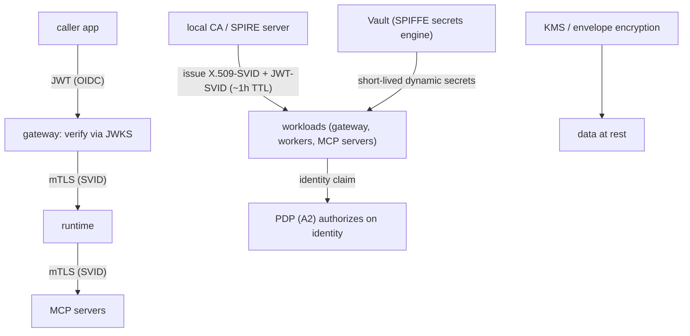

# Reference Architecture — Identity + Secrets Substrate (domain B·1)

> **Status:** v1 reference · **Family:** B · Security · **Tier:** CORE
> **Owning phase:** P0 (thin: 1 JWT + mTLS on 1 hop) → P1 (full mesh + rotation).
> **Research note:** **SPIFFE/SPIRE** is the de-facto non-human-identity (NHI) standard for agents
> in 2026 — SVIDs tie identity to *workloads*, not people, and **ephemeral SVIDs auto-rotate
> (~hourly), eliminating credential-rotation projects.** Vault Enterprise 2.0 ships a **SPIFFE
> secrets engine** (issues JWT-SVIDs). SPIFFE underpins mTLS between agents. [HashiCorp; Vault;
> CSA "NHI Governance Vacuum"; riptides SPIFFE+OAuth2]

## 1. Purpose
Give every caller, workload, agent, and tool a **cryptographic identity**, encrypt and
authenticate **every hop** (mTLS), and make credentials **short-lived and self-rotating** so there
are effectively **no static secrets** to leak. This is "real certs + JWT" the way production does
it — the foundation the user explicitly wanted.

## 2. Architecture

## 3. Coverage
- **Caller identity:** JWT via OIDC issuer + JWKS verification at the gateway.
- **Workload identity:** SPIFFE SVID (X.509 for mTLS, JWT for app-layer) per service.
- **Tool identity:** OAuth 2.1 scoped tokens + **RFC 8707** resource indicators (per-server, no
  cross-server reuse).
- **Secret lifecycle:** issue → auto-rotate (~hourly) → revoke; dynamic secrets from Vault;
  envelope encryption (KMS) for data at rest.

## 4. Metrics & thresholds
| Metric | Meaning | Target/anchor |
|---|---|---|
| credential TTL | how long any cred is valid | SVID **~1h** (ephemeral); access JWT **15min** |
| static-secret count | long-lived secrets in the system | **→ 0** (dynamic/SPIFFE everywhere) |
| mTLS coverage | service-to-service hops encrypted+authed | **100%** |
| time-to-revoke | identity revocation → effective | minutes (bounded by TTL) |
| rotation-failure rate | auto-rotation errors | ~0; alert on any |

## 5. Key interfaces (seam → contracts pass)
- **Identity claim** `(spiffe_id | sub, tenant_id, scopes[])` consumed by the **PDP** (A2) and
  stamped on every span/audit entry.
- **JWT claims schema** (caller) + **SVID** (workload) — the two identity primitives.

## 6. Failure modes + how we break it (C5)
- **CA / intermediate compromise** → short SVID TTL bounds blast radius; rotate intermediate.
- **Expired SVID** → auto-renew before expiry; on failure **fail-closed**. *Break:* revoke a
  worker's SVID, show it can no longer call peers.
- **Secret sprawl** → scanner asserts static-secret count = 0; any committed secret fails CI.

## 7. SLO linkage + phase
Underpins **SLO5** (identity is the basis of least-privilege) and **C8**. **P0:** one real JWT +
mTLS on the single gateway→runtime hop. **P1:** full SPIFFE/SPIRE mesh + Vault rotation.

## 8. v1 caveats
- SPIRE vs a lighter local-CA + cert-manager decided at P1 against live docs (C10); SPIFFE is the
  target model regardless of issuer.
- mTLS via service mesh (Istio/linkerd) vs app-layer decided with the infra-mastery/07 networking
  reuse boundary.

## 9. Sources
- SPIFFE for agentic/NHI (HashiCorp): https://www.hashicorp.com/en/blog/spiffe-securing-the-identity-of-agentic-ai-and-non-human-actors
- Vault SPIFFE secrets engine / NHI: https://aembit.io/blog/the-what-where-and-why-of-workload-identity-and-access-management/
- CSA Non-Human Identity governance: https://labs.cloudsecurityalliance.org/research/csa-whitepaper-nonhuman-identity-agentic-ai-governance-v1-cs/
- SPIFFE meets OAuth2 (DCR, register-on-first-use): https://riptides.io/blog-post/spiffe-meets-oauth2-current-landscape-for-secure-workload-identity-in-the-agentic-ai-era/
