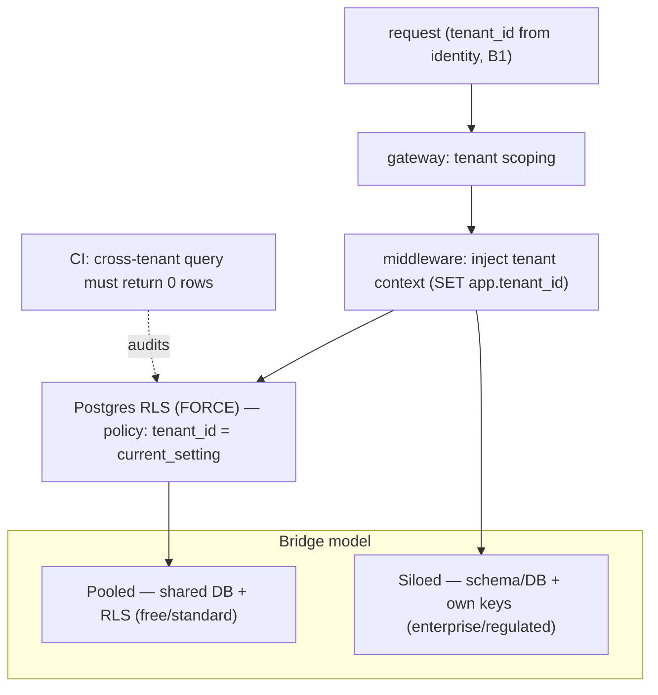

# Reference Architecture — Tenant Isolation Tiers (domain B·2)

> **Status:** v1 reference · **Family:** B · Security · **Tier:** CORE · **Owning phase:** P1.
> **Research note:** 2026 SaaS converges on three patterns — **pooled** (shared DB + Postgres
> **RLS**), **silo** (schema/DB-per-tenant), **bridge** (hybrid: standard tiers pooled, enterprise/
> regulated siloed — now the most common mature pattern). Enforcement must be **multi-layer**: DB
> RLS + middleware tenant-context + gateway scoping + automated cross-tenant tests that return
> **zero** rows. Beware **privileged-role bypass** → use `FORCE ROW LEVEL SECURITY` + least-priv
> app roles. [AWS RLS; ClickHouse Postgres multi-tenant; arielsoftwares 2026]

## 1. Purpose
Make cross-tenant data exposure **impossible by construction** — a cross-tenant leak is a security
**incident**, not a bug. Isolation is a **tiered** decision (cost/efficiency vs blast-radius), not
a single flag.

## 2. Architecture

## 3. Coverage
- **Three tiers:** pooled (RLS, gold for efficiency) · silo (highest isolation, own keys/residency)
  · **bridge** (the default — promote heavy/enterprise tenants pool→silo).
- **Multi-layer enforcement:** RLS (DB) + tenant-context (middleware) + scoping (gateway) +
  automated cross-tenant tests.
- **Noisy-neighbor:** per-tenant rate + cost caps (links E1); ML-style heavy-tenant detection →
  promote to silo before degradation.
- **Per-tenant keys + residency** (EU/India) for the siloed tier.

## 4. Metrics & thresholds
| Metric | Meaning | Target/anchor |
|---|---|---|
| cross-tenant leakage | the cardinal incident | **0** (any = SEV) |
| RLS coverage | tenant tables with FORCE RLS + read/write policies | **100%** |
| cross-tenant test result | automated probe returns | **0 rows**, every CI run |
| noisy-neighbor caps | per-tenant rate/cost enforced | 100% (ties SLO3) |
| isolation tier policy | enterprise/regulated → silo | per tenant class |

## 5. Key interfaces (seam → contracts pass)
- **`tenant_id`** stamped on every request, span, row, audit entry; propagated via **W3C baggage**.
- **RLS policy** (read + write) + the tenant-context setting convention.
- Tenant **tier** (pooled/silo) as a tenant-config attribute.

## 6. Failure modes + how we break it (C5)
- **Privileged-role RLS bypass** → `FORCE ROW LEVEL SECURITY` + least-priv app role (never run app
  as table owner). *Break:* try a cross-tenant read as the app role, show 0 rows.
- **Missing tenant_id on a query path** → deny + the cross-tenant test catches it.
- **Noisy neighbor** → one tenant saturates → per-tenant caps + promotion to silo.

## 7. SLO linkage + phase
**SLO3** (per-tenant caps) + the core security guarantee. Built in **P1** (pooled+RLS first; silo
tier wired for the enterprise/regulated lane).

## 8. v1 caveats
- pgvector RLS specifics + cross-tenant ANN-recall isolation verified at P1.
- Per-tenant encryption keys (BYOK) likely silo-tier-only in v1.

## 9. Sources
- Multi-tenant data isolation with Postgres RLS (AWS): https://aws.amazon.com/blogs/database/multi-tenant-data-isolation-with-postgresql-row-level-security/
- Multi-tenant SaaS on Postgres (ClickHouse): https://clickhouse.com/resources/engineering/multi-tenant-saas-postgres-architecture
- Multi-tenant SaaS 2026 guide (pooled/silo/bridge): https://www.arielsoftwares.com/multi-tenant-architecture-saas-guide/
