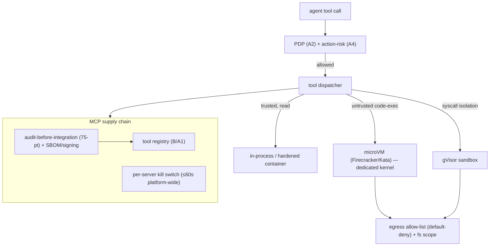

# Reference Architecture — Tool Supply-Chain + Sandbox Isolation (domain B·3)

> **Status:** v1 reference · **Family:** B · Security · **Tier:** CORE
> **Owning phase:** P1 (basic sandbox + MCP audit) → P4 (full).
>
> **Research update (live-verified June 2026):**
>
> **Sandbox tiers** are settled — **microVMs (Firecracker/Kata)** strongest (dedicated kernel per
> workload), **gVisor** (user-space kernel, syscall interception), **hardened containers** (trusted
> code only). E2B boots a Firecracker microVM in **~150ms**; Modal uses gVisor+GPU.
> [Northflank; Spheron; sandbox list 2026; arXiv:2603.20953]
>
> **MCP Official Registry** (launched Sept 8 2025, live at `registry.modelcontextprotocol.io`):
> - **Storage:** PostgreSQL (confirmed in open-source registry repo)
> - **Scale:** 9,652 server records (latest versions) + 28,959 total records as of May 2026
> - **Versioning is immutable by design** — once a version is published it cannot be changed;
>   a new version must be published. Range specifiers (`^1.2.3`, `~1.2.3`) are **prohibited**.
>   Semantic versioning or date-based (`2025-06-18`) only.
> - **Server lifecycle states:** `active` · `deprecated` (visible with warning) · `deleted`
>   (hidden by default) — status changed via `PATCH /v0.1/servers/{name}/versions/{version}/status`
> - **`server.json` manifest** (the enrollment artifact — key fields):
>   ```json
>   { "name": "io.github.org/my-server", "version": "1.0.0",
>     "packages": [{"registryType": "npm", "transport": {"type": "stdio"}}] }
>   ```
> - **Namespace ownership** verified via GitHub OAuth (`io.github.*`) or DNS/HTTP challenge
> - **Risk metadata gap:** the base MCP spec does NOT include tool-level risk classification
>   (e.g. High/Low). Enterprise overlays (AWS Agent Registry approval workflow, Google Cloud API
>   Registry governance) provide this. **ARIA fills this gap with `ToolSpec.risk_class`** in the
>   tool registry (A1), an ARIA-specific extension over the base MCP manifest.
> - **API:** `GET /v0.1/servers`, `GET /v0.1/servers/{name}/versions/{version}`
>
> [Source: MCP Registry GitHub](https://github.com/modelcontextprotocol/registry)
> [Source: MCP Versioning Docs](https://modelcontextprotocol.io/registry/versioning)
> [Source: WorkOS MCP Registry Architecture](https://workos.com/blog/mcp-registry-architecture-technical-overview)
> [Source: MCP Roadmap — enterprise readiness](https://modelcontextprotocol.io/development/roadmap)

## 1. Purpose
The agent's tools run code and reach networks on its behalf — the **highest-value attack surface**.
Isolate side-effecting/code-exec tools, **audit every MCP server before integration**, and keep a
**platform-wide kill switch**. The blast radius of one compromised MCP server is "every agent that
uses it" — engineer so that being hit doesn't become consequence.

## 2. Architecture


## 3. Coverage
- **Sandbox tier per tool** (declared on ToolSpec): microVM (untrusted code-exec) · gVisor
  (syscall isolation) · hardened container/in-proc (trusted reads).
- **Egress allow-list** (default-deny) + **filesystem scoping** for sandboxed tools.
- **MCP supply chain:** audit-before-integration + re-audit on minor version · SBOM + image
  signing · RFC 8707 scoped tokens (B1) · **kill switch** · deterministic pre-action authorization
  (ties A2/A4 — authorize *before* the tool call).
- The unsolved-protocol gap: MCP lacks server identity attestation → we compensate with audit +
  scoping + screening + kill switch.

## 4. Metrics & thresholds
| Metric | Meaning | Target/anchor |
|---|---|---|
| code-exec sandboxed | untrusted exec in a sandbox | **100%** |
| egress allow-list coverage | sandboxed tools default-deny egress | **100%** |
| MCP audited-before-integration | servers reviewed pre-connect | **100%** |
| kill-switch propagation | revoke a server platform-wide | **< 60s** |
| sandbox cold-start | overhead per exec | ~150ms (E2B-class microVM) |

## 5. Key interfaces (seam → contracts pass)
- **ToolSpec.sandbox_tier** + `egress_allowlist[]` + `fs_scope`.
- **MCP server manifest + audit record** (scopes, SBOM, signature, last-audit version).
- **Kill-switch signal** (server_id → revoked) read by the dispatcher.

## 6. Failure modes + how we break it (C5)
- **MCP server compromise** → audit + RFC 8707 scoping (no cross-server token reuse) + screening +
  kill switch. *Break:* flip the kill switch, show all agents stop calling within 60s.
- **Egress exfiltration** from code-exec → default-deny allow-list. *Break:* attempt a
  disallowed network call from the sandbox, show it blocked.
- **Sandbox escape** → microVM (dedicated kernel) for genuinely untrusted code, not containers.

## 7. SLO linkage + phase
**SLO5**. **P1:** one real sandboxed tool (microVM/gVisor) + MCP audit + kill switch. **P4:** full
tiering + SBOM/signing + pre-action authorization.

## 8. v1 caveats
- Local sandbox choice (gVisor vs Firecracker on k3d/WSL2) decided at P1 — microVM nesting on WSL2
  may push us to gVisor locally, Firecracker on the AWS lift (P8).
- SBOM/signing is the cheap part of the DEFER'd full supply-chain item — we do signing+SBOM, defer
  full SLSA provenance.

## 9. Sources
- How to sandbox AI agents 2026 (microVM/gVisor): https://northflank.com/blog/how-to-sandbox-ai-agents
- E2B/Daytona/Firecracker setup: https://www.spheron.network/blog/ai-agent-code-execution-sandbox-e2b-daytona-firecracker/
- Coding-agent sandbox landscape 2026: https://gist.github.com/wincent/2752d8d97727577050c043e4ff9e386e
- Deterministic pre-action authorization (arXiv:2603.20953): https://arxiv.org/pdf/2603.20953
- MCP Official Registry (open-source, Go + PostgreSQL): https://github.com/modelcontextprotocol/registry
- MCP versioning spec (immutable-by-design): https://modelcontextprotocol.io/registry/versioning
- MCP Registry architecture overview: https://workos.com/blog/mcp-registry-architecture-technical-overview
- MCP roadmap — enterprise readiness: https://modelcontextprotocol.io/development/roadmap
- AWS Agent Registry (approval workflow, lifecycle): https://docs.aws.amazon.com/bedrock-agentcore/latest/devguide/registry.html
- Google tool governance + Cloud API Registry: https://cloud.google.com/blog/products/ai-machine-learning/new-enhanced-tool-governance-in-vertex-ai-agent-builder
