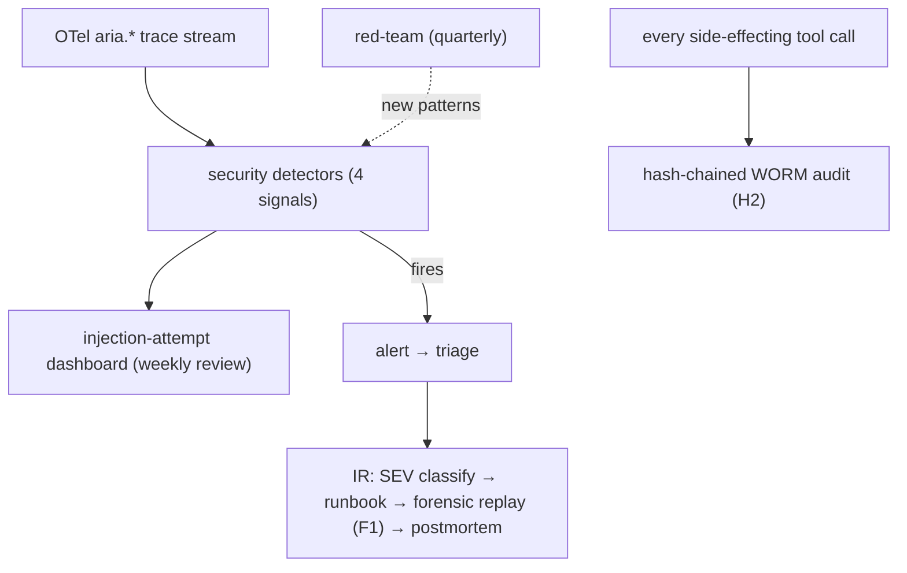

# Reference Architecture — Security Observability & Incident Response (domain B·4)

> **Status:** v1 reference · **Family:** B · Security · **Tier:** CORE · **Owning phase:** P2 →.
> **Research note:** OWASP GenAI Q1-2026 data: **prompt injection present in >70% of production AI
> deployments** assessed. Injection **leaves fingerprints in traces** — a monitor that knows what
> to look for flags it before incident. NIST AI Agent Standards Initiative (Feb 17 2026) names
> persistent memory + non-determinism as attack surfaces. [OWASP GenAI; digitalapplied 60-pt
> audit; tekninjas injection playbook; NIST]

## 1. Purpose
The **security lane** of observability: detect injection/abuse from the trace stream, prove what
happened (WORM audit), and respond (SEV process). Prompt injection is unsolved at the model layer;
we make *being hit* non-consequential and *visible*.

## 2. Architecture

## 3. Coverage — the 4 detection signals (from OWASP/industry)
1. **Anomalous tool-call patterns** (unexpected tool, sudden write attempts).
2. **Retrieval results containing known injection markers** ("ignore previous…", imperative
   payloads in tool/RAG output).
3. **Conversation/trajectory deviation** from typical flows.
4. **Rising rejection rates** (probing for gaps).
Plus: structured labeled message blocks (user vs tool vs system), output validation (allow-list +
schema) on every tool call, weekly alert review, quarterly red-team feeding the detector library.

## 4. Metrics & thresholds
| Metric | Meaning | Target/anchor |
|---|---|---|
| injection-success-with-side-effect | the cardinal metric | **0 / quarter** (SLO5; any = SEV) |
| detection coverage | the 4 signals instrumented | 4/4 |
| audit completeness (side-effecting) | every write logged to WORM | **100%** |
| MTTR (security incident) | detect → contained | tracked; bounded by runbook |
| red-team cadence | adversarial exercises | **quarterly**; new patterns → detectors |
| injection-alert false-positive rate | tuning health | tracked; tune weekly |

## 5. Key interfaces (seam → contracts pass)
- **Security-signal schema** on spans (`aria.security.*`: injection_suspected, signal_kind, score).
- **Injection-attempt event** (run_id, signal, payload-excerpt-redacted) → dashboard + audit.
- Consumes **agent replay (F1)** for forensic reconstruction; writes the **audit entry (H2)**.

## 6. Failure modes + how we break it (C5)
- **Silent injection** → 4-signal detection + output validation. *Break:* feed a retrieved doc with
  an injection payload, show detection fires + audit records `injection_suspected=true` + the agent
  doesn't take the side effect (least-privilege A2/A4 + mandatory HITL on Critical).
- **Alert fatigue** → weekly review + FP tuning; severity-routing (ties HITL notification UX).
- **Audit gap** → 100% enforced at the dispatcher; gap is a SEV.

## 7. SLO linkage + phase
**SLO5** directly. Detectors + dashboard in **P2** (on the obs plane); IR process + red-team mature
through P4–P7. The full injection *defense-in-depth* lives in security domain (P4) — this is the
*observability + response* half.

## 8. v1 caveats
- Detector implementation (heuristics vs a small classifier) decided at P2; start heuristic +
  marker lists, add a classifier if FP rate demands.
- Overlaps the eval **safety dimension** (G1) — eval *scores* safety offline; this *detects* in
  production. Both, by design.

## 9. Sources
- OWASP GenAI Exploit Round-up Q1 2026: https://genai.owasp.org/2026/04/14/owasp-genai-exploit-round-up-report-q1-2026/
- Agent observability audit 60-point checklist 2026: https://www.digitalapplied.com/blog/agent-observability-audit-60-point-checklist-2026
- Prompt injection Tier-One defense playbook 2026: https://tekninjas.com/blogs/cybersecurity-ai-agents-prompt-injection-2026/
- Agentic AI risks (OWASP/NIST): https://www.lumenova.ai/blog/agentic-ai-risks-owasp-nist/
