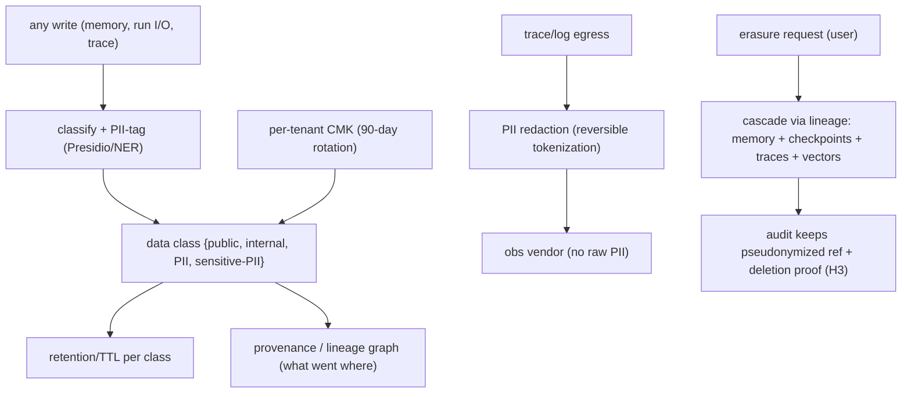

# Reference Architecture — Data Classification + Erasure + Lifecycle (domain C·1)

> **Status:** v1 reference · **Family:** C · Data · **Tier:** CORE
> **Owning phase:** P1 (classification + redaction) → P7 (full erasure cascade + evidence).
> **Research note:** 2026 production pattern = a **classification pipeline that auto-labels data
> flowing through agents**, PII redaction (Presidio/NER + **reversible tokenization** where utility
> demands), **per-tenant CMK with 90-day rotation**, WORM audit (7-yr), and a **provenance graph**
> that captures lineage *before* erasure requests arrive — without execution records of "what was
> processed where," erasure can't be executed with confidence. [appscale PII pipeline; callsphere;
> dev.to GDPR-prove-it; digitalapplied]

## 1. Purpose
Know what data is sensitive (classify at write), keep it only as long as allowed (retention/TTL),
delete it on request *everywhere it propagated* (erasure cascade), and never let raw PII leave the
trust boundary (redaction before egress). The foundation compliance (H2) and the flywheel (G5)
both stand on.

## 2. Architecture

## 3. Coverage
- **Classification + PII tagging** at write (4 classes: public / internal / PII / sensitive-PII).
- **Retention/TTL per class** (default 30-day; regulated lane longer).
- **Right-to-erasure cascade** across memory, checkpoints, traces, **and vector embeddings**
  (embeddings derived from PII need targeted vector-store deletion) — driven by the lineage graph.
- **PII redaction before egress** (reversible tokenization where utility needs it).
- **GDPR/DPDPA audit fields:** triggering prompt · records retrieved + classification · external
  transmissions + destinations · legal-basis policy · enforcement events.

## 4. Metrics & thresholds
| Metric | Meaning | Target/anchor |
|---|---|---|
| classification coverage | PII-bearing writes tagged | **100%** |
| erasure completeness | cascade incl. vectors | **100%** (audit retains pseudonymized ref only) |
| erasure SLA | request → deleted | within policy (DPDPA/GDPR window) |
| raw PII egress | PII leaving trust boundary | **0** (redact before obs vendor) |
| CMK rotation | per-tenant key rotation | **90 days** |

## 5. Key interfaces (seam → contracts pass)
- **`data_class` tag** on every record + the **provenance/lineage graph** (record → where copied).
- **Erasure-request contract** `(user_id) → cascade plan → deletion proof`.

## 6. Failure modes + how we break it (C5)
- **Erasure misses embeddings** → lineage graph drives targeted vector deletion. *Break:* erase a
  user, prove the vector store no longer returns their content.
- **Can't locate data at erasure time** → lineage captured *at write*, not reconstructed later.
- **PII leaks to obs vendor** → redaction before egress; vendor never sees raw PII.

## 7. SLO linkage + phase
Compliance backbone (feeds H2/H3). **P1:** classification + redaction. **P7:** full erasure
cascade + deletion-proof evidence.

## 8. v1 caveats
- Model-weight unlearning (PII encoded in fine-tunes) is hard → v1 policy: don't train on
  unconsented PII; rely on data-layer erasure, document the weight-unlearning gap (ties D4/G5).
- Lineage-graph store (Postgres edges vs a graph DB) decided at P7.

## 9. Sources
- PII redaction pipeline for LLM workloads 2026: https://appscale.blog/en/blog/pii-redaction-pipeline-llm-presidio-ner-reversible-tokenisation-2026
- AI agents + GDPR "prove it": https://dev.to/waxell/your-ai-agents-are-processing-personal-data-gdpr-now-requires-you-to-prove-it-1ghd
- Data privacy in AI agents (GDPR/HIPAA/PII): https://callsphere.ai/blog/data-privacy-ai-agents-gdpr-hipaa-pii-handling
