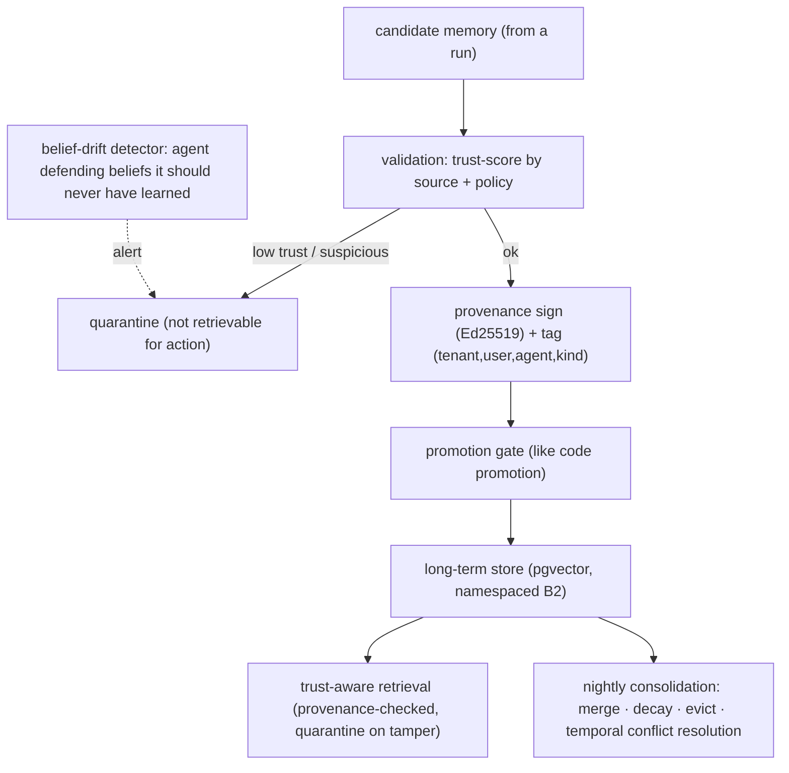

# Reference Architecture — Memory Governance (domain C·2)

> **Status:** v1 reference · **Family:** C · Data · **Tier:** CORE · **Owning phase:** P5.
> **Has a science companion:** [memory-governance-science.md](./memory-governance-science.md).
> **Research note:** memory is a **belief store**, and poisoning it is now **OWASP ASI06:2026**.
> MINJA-style attacks reach **>95% injection / 70% success with no special privileges**, and they
> defeat normal defenses because those *detect malicious actions, not corrupted beliefs.* Defense
> needs new primitives: **memory contracts · belief-drift detection · context provenance · trust-
> aware retrieval · cryptographic provenance (Ed25519-sign each entry)**. [arXiv:2601.05504; SSGM
> arXiv:2603.11768; OWASP ASI06; mguard]

## 1. Purpose
Govern *what the agent is allowed to believe* across sessions: validate memories before they
persist, sign their provenance, promote them like code (validate → promote → long-term), detect
belief drift, and resolve conflicts — so a planted "fact" can't quietly steer the agent days later.

## 2. Architecture

## 3. Coverage
- **Promotion pipeline:** raw → validated (trust-scored) → signed → promoted → long-term. Default
  for production (most frameworks leave consolidation unimplemented — we don't).
- **Three kinds** (episodic / semantic / procedural), **three tiers** (short / working / long-term).
- **Provenance signing** (Ed25519 per entry; tampered → quarantined on read).
- **Trust-aware retrieval:** low-trust/unvalidated memories not usable for side-effecting decisions.
- **Belief-drift detection · conflict resolution (temporal) · consolidation/decay/eviction.**
- **Namespacing** by `(tenant, user, agent)` (B2) — cross-tenant memory leak = SEV.

## 4. Metrics & thresholds
| Metric | Meaning | Target/anchor |
|---|---|---|
| poisoned-memory caught | MINJA/AgentPoison stopped at gate | high; tracked vs red-team corpus |
| tampered-entry quarantine | unsigned/altered entries blocked on read | **100%** |
| cross-tenant memory leak | namespace breach | **0** (SEV) |
| belief-drift alerts | agent defending unlearnable beliefs | monitored; investigate each |
| conflict-resolution rate | contradictions reconciled | tracked (temporal: keep both w/ validity) |
| stale-fact rate | acted on outdated memory | < threshold; TTL + freshness scoring |

## 5. Key interfaces (seam → contracts pass)
- **Memory item** `{id, tenant, user, agent, kind, content, embedding, provenance_sig,
  trust_score, importance, source_run_id, valid_from/until, last_accessed}`.
- **Promotion record** (candidate → decision → reasoning) for audit/debug.
- Retrieval API enforces provenance + trust + namespace.

## 6. Failure modes + how we break it (C5)
- **MINJA / AgentPoison / MemoryGraft** → trust-aware retrieval + provenance + belief-drift.
  *Break:* plant a plausible poisoned memory via normal queries, show it's quarantined / not
  promoted / not usable for a side-effecting action.
- **Stale fact** → temporal validity + freshness scoring.
- **Conflict** → temporal resolution (keep both with validity windows; Zep-style).
- **Cross-tenant leak** → namespacing enforced at retrieval (B2 RLS).

## 7. SLO linkage + phase
Security (memory = attack surface, SLO5-adjacent) + quality. Built in **P5**; the memory item +
provenance schema are frozen there for the flywheel (G5).

## 8. v1 caveats
- Framework choice (Mem0 / Zep / LangMem / Letta / build) decided at P5 against the reuse boundary;
  all 8 lack enterprise governance (glossary/lineage/entity-resolution) — we add it.
- Multi-agent concurrent-write consistency (ordering/visibility) is a known hard edge → v1 uses
  last-write-wins + temporal validity, documented as a known-weak.

## 9. Sources
- Memory Poisoning Attack & Defense (arXiv:2601.05504): https://arxiv.org/abs/2601.05504
- SSGM — Stability & Safety Governed Memory (arXiv:2603.11768): https://arxiv.org/html/2603.11768v1
- mguard (MINJA/AgentPoison/MemoryGraft defense): https://github.com/mguard-ai/mguard
- Agent memory at scale 2026 (Letta/Zep/Mem0/LangMem): https://agentmarketcap.ai/blog/2026/04/10/agent-memory-vendor-landscape-2026-letta-zep-mem0-langmem
