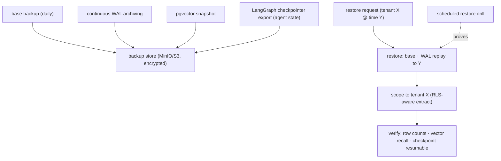

# Reference Architecture — Backup / Restore Drill (domain C·3)

> **Status:** v1 reference · **Family:** C · Data · **Tier:** CORE-LITE · **Owning phase:** P7.
> **Scope (CORE-LITE):** a working restore *drill*, not full DR. Multi-region failover is DEFER'd
> to the AWS lift (P8). The first enterprise question is *"can you restore my workspace?"* — not
> *"what's your DR strategy?"* — so we build the answer to that.
> **Research note:** Postgres **PITR** = base backup + continuous **WAL archiving** → restore to
> any point by replaying WAL; pgvector 0.8.1 rides along; cloud PITR uses instant snapshots.
> PG18 GA / PG19 Beta (2026-06). [PostgreSQL docs; pgEdge; Cloud SQL PITR]

## 1. Purpose
Be able to **"restore tenant X to timestamp Y"** — Postgres (runs/agents/prompts + checkpointer),
the vector store, and agent state — and *prove the drill works* on a schedule. Recovery, not just
backup; an untested backup is a guess.

## 2. Architecture

## 3. Coverage
- **Postgres PITR** (base backup + WAL archiving) → restore to any point.
- **pgvector snapshot** (vector store consistency with the relational restore).
- **Agent-state export** (checkpointer) so a restored run is resumable.
- **Tenant-scoped restore** (RLS-aware extract for "restore tenant X" without touching others).
- **Scheduled drill** that actually performs a restore + verification (not a backup that's never
  tested).

## 4. Metrics & thresholds
| Metric | Meaning | Target/anchor |
|---|---|---|
| RPO | max data loss window | bounded by WAL archive cadence (minutes) |
| RTO | restore time | drill-measured; documented |
| drill cadence | restore actually exercised | scheduled (e.g., monthly); pass/fail recorded |
| restore verification | post-restore integrity | row counts + vector recall + checkpoint resumes |
| tenant-scoped restore | restore one tenant only | proven (no cross-tenant bleed) |

## 5. Key interfaces (seam → contracts pass)
- **Restore request** `(tenant_id, target_time) → restored, verification report`.
- Backup manifest (base + WAL range + vector snapshot + checkpoint export) per point-in-time.

## 6. Failure modes + how we break it (C5)
- **Backup that never restores** → the scheduled *drill* is the test; a failed drill is an alert.
- **Vector/relational skew** (restore Postgres, stale vectors) → snapshot both at a consistent point.
- **Restored run won't resume** → checkpoint export + verify resumability in the drill.

## 7. SLO linkage + phase
Resilience/enterprise-readiness. Built **CORE-LITE in P7**; full multi-region DR is **DEFER → P8
(AWS lift)** — documented, not silently dropped.

## 8. v1 caveats
- Tooling (pgBackRest / WAL-G / cloud-native) decided at P7 against the infra-mastery reuse boundary.
- Cross-store consistency (Postgres + pgvector + MinIO audit) at a single point-in-time is the
  trickiest part; v1 brackets it with a quiesce window if needed, documented.

## 9. Sources
- PostgreSQL Continuous Archiving + PITR: https://www.postgresql.org/docs/current/continuous-archiving.html
- PITR in PostgreSQL (pgEdge): https://www.pgedge.com/blog/point-in-time-recovery-pitr-in-postgresql
- Cloud SQL PITR (instant snapshots): https://docs.cloud.google.com/sql/docs/postgres/backup-recovery/pitr
