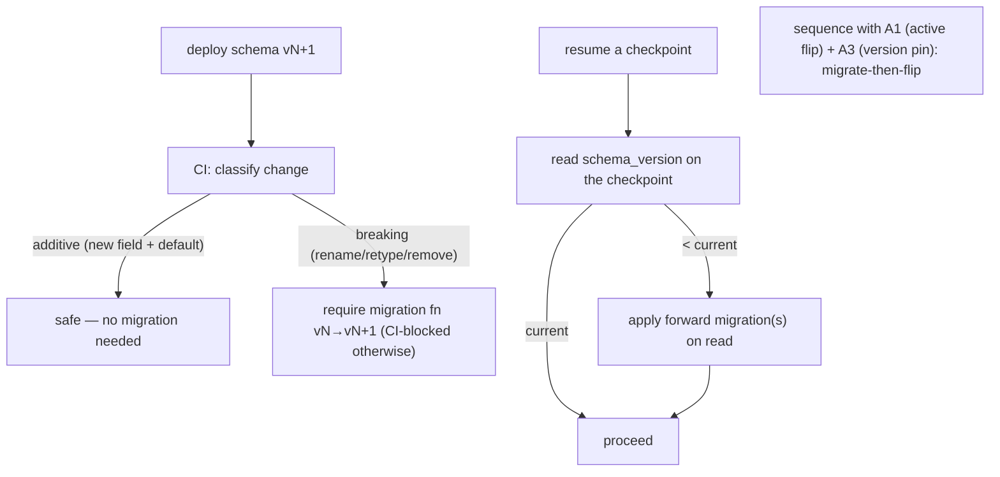

# Reference Architecture — State-Schema Migration (domain D·1)

> **Status:** v1 reference · **Family:** D · Reliability · **Tier:** CORE · **Owning phase:** P4.
> **The PDFs' own named gap:** LangGraph has no built-in state-schema migration — **renaming a
> field silently loses that field's data in every existing checkpoint**; adding a field with a
> default is safe. Building this is rare and high-signal. (Verify LangGraph specifics at P4 per C10.)

## 1. Purpose
Evolve the durable **state schema** of long-running agents without corrupting in-flight
checkpoints. A 30-min–multi-day run started on schema vN must resume correctly after vN+1 ships.

## 2. Architecture

## 3. Coverage
- **Change classification:** additive (safe) vs breaking (rename/retype/remove → migration required).
- **Migration-on-resume:** detect `schema_version`, apply forward migration(s) before the run continues.
- **Coordination:** with workflow/execution versioning (A3 — pin risky changes) and the active-version
  flip (A1 — migrate *then* flip).

## 4. Metrics & thresholds
| Metric | Meaning | Target/anchor |
|---|---|---|
| orphaned checkpoints | runs broken by a schema change | **0** |
| schema-version coverage | checkpoints carrying a version tag | **100%** |
| breaking-change-without-migration | shipped unguarded | **0** (CI-blocked) |
| migration success rate | forward migrations applied cleanly | ~100%; failures alert |

## 5. Key interfaces (seam → contracts pass)
- **`schema_version`** on every checkpoint/state record.
- **Migration registry** `vN → vN+1` forward functions, tested against checkpoint snapshots.

## 6. Failure modes + how we break it (C5)
- **Silent field rename** → CI blocks a breaking change without a migration. *Break:* rename a state
  field, show CI fails; add the migration, show an old checkpoint resumes correctly.
- **Resume on un-migrated checkpoint** → detect-and-migrate on read.
- **Migration bug corrupts state** → migrations tested on real checkpoint snapshots before promote.

## 7. SLO linkage + phase
**SLO2** (deep runs survive deploys). Built in **P4**; pairs with A3 (pin) + A1 (flip).

## 8. v1 caveats
- If we adopt Temporal for the long lane (P3), some of this rides Worker Versioning (A3); LangGraph-
  only state still needs explicit migration. Decide the exact mechanism at P4 against live docs.

## 9. Sources
- Durable execution landscape 2026 (state/resume): https://devstarsj.github.io/2026/04/03/durable-execution-temporal-restate-dbos-distributed-workflows-2026/
- Durable execution patterns for AI agents: https://zylos.ai/research/2026-02-17-durable-execution-ai-agents
