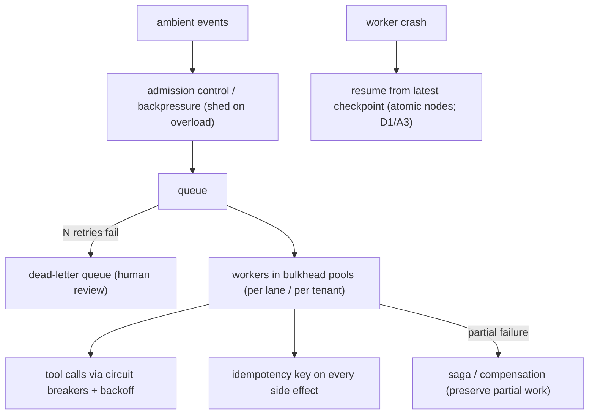

# Reference Architecture — Resilience Patterns (domain D·2)

> **Status:** v1 reference · **Family:** D · Reliability · **Tier:** CORE · **Owning phase:** P3 →.
> **Has a science companion:** [reliability-science.md](./reliability-science.md).
> **Research note:** the 2026 recommended resilience stack = shared resilience SDK + mesh policies
> (timeouts/retries) + workflow engine (compensation) + **queues with DLQs + admission control/
> backpressure** + OTel-first. Bulkhead's truth: *shared resources = shared fate.* [Temporal error-
> handling; AWS bulkhead; "Towards a Science of AI Agent Reliability" arXiv:2602.16666]

## 1. Purpose
Contain probabilistic, partial, multi-step agent failures so they don't cascade. Agents fail
unlike deterministic services — silently, mid-trajectory, across steps — so the *harness* must do
what the model can't: isolate, shed, retry-safely, and recover.

## 2. Architecture

## 3. Coverage
| Pattern | Where it applies |
|---|---|
| **Bulkheads** | per-lane / per-tenant worker pools — one tenant's spike can't starve others |
| **Backpressure / load-shedding / admission control** | ambient ingestion on a 10× event spike |
| **DLQ + poison-message handling** | events the agent can't process → DLQ, not infinite retry |
| **Circuit breakers + backoff** | MCP/tool calls to flaky dependencies |
| **Idempotency** | every side-effecting tool call (`{plan_step_id}::{index}`) |
| **Saga / compensation** | partial multi-step failure → preserve work done, don't roll back blindly |
| **Resume-from-checkpoint** | worker crash → continue (atomic node decomposition, D1/A3) |

## 4. Metrics & thresholds
| Metric | Meaning | Target/anchor |
|---|---|---|
| DLQ depth | unhandleable events accumulating | monitored; **growth alerts** |
| poison-message handling | to DLQ after N, never infinite | **100%** (no infinite retry) |
| idempotency coverage | side effects with keys | **100%** |
| bulkhead isolation | one pool's failure contained | proven (no cross-pool cascade) |
| crash-resume time | worker death → run continues | **< 30s** |
| load-shed activation | graceful degradation on spike | activates before cascade |

## 5. Key interfaces (seam → contracts pass)
- **Idempotency-key convention** `{plan_step_id}::{index}` (same-step replay → drop; new index → commit).
- **DLQ contract** (event → DLQ record + reason) + the admission/backpressure policy.
- **Circuit-breaker config** per dependency.

## 6. Failure modes + how we break it (C5)
- **Event spike → cascade** → backpressure + load-shed. *Break:* 10× event burst, show shedding +
  DLQ + no cascade + catch-up after.
- **Poison event infinite-retries** → DLQ after N. *Break:* a malformed event, show it dead-letters.
- **Crash mid-iteration loses items** → atomic node decomposition (D1/A3). *Break:* kill a worker
  mid-run, show resume from checkpoint.
- **Shared fate** → bulkheads. *Break:* saturate one tenant's pool, show others unaffected.

## 7. SLO linkage + phase
**SLO2** + general availability. Built in **P3** (ambient lane forces DLQ/backpressure) and extended
through P4. Chaos GameDays (C5) exercise every pattern.

## 8. v1 caveats
- Queue tech (Redis Streams vs SQS-equiv on k3d) decided at P3; DLQ semantics tested in the drill.
- Saga/compensation only where partial-work preservation matters; simple steps just retry.

## 9. Sources
- Error handling / resilience in distributed systems (Temporal): https://temporal.io/blog/error-handling-in-distributed-systems
- Bulkhead pattern (AWS): https://aws.amazon.com/blogs/containers/building-a-fault-tolerant-architecture-with-a-bulkhead-pattern-on-aws-app-mesh/
- Towards a Science of AI Agent Reliability (arXiv:2602.16666): https://arxiv.org/html/2602.16666v2
