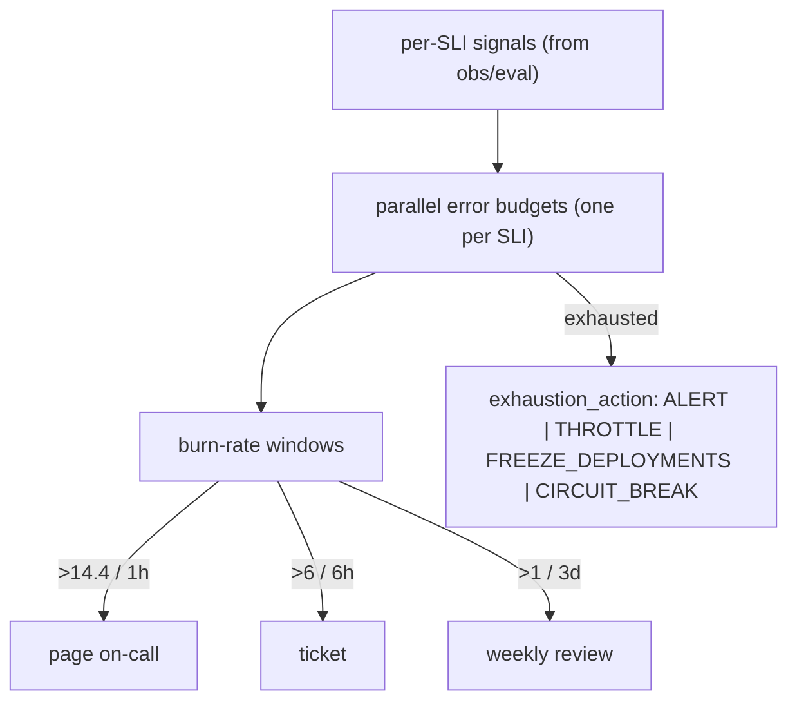

# Reference Architecture — Error Budgets + SLO Enforcement (domain D·3)

> **Status:** v1 reference · **Family:** D · Reliability · **Tier:** CORE · **Owning phase:** P2 →.
> **Research note:** AI agents need **multiple error budgets in parallel — one per SLI** (accuracy
> budget healthy while latency burns). Burn-rate alerting (Google SRE): **page > 14.4 / 1h**, ticket
> > 6 / 6h, weekly > 1 / 3d. Microsoft **Agent SRE** adds agent SLIs (ToolCallAccuracy,
> HallucinationRate, DelegationChainDepth, CalibrationDelta) and `exhaustion_action` ∈ {ALERT,
> THROTTLE, FREEZE_DEPLOYMENTS, CIRCUIT_BREAK}. (LangChain 2026: 57% have agents in prod; 32% cite
> quality as the #1 barrier.) [Google SRE workbook; MS Agent SRE; buildmvpfast]

## 1. Purpose
Turn the 5 SLOs from aspirations into **enforced budgets** with statistical burn-rate alerts and
automated exhaustion actions — so reliability is measured and defended, not hoped for.

## 2. Architecture

## 3. Coverage
- **Parallel budgets**, one per SLI: the 5 SLOs (latency, completion, cost, loop, injection) **plus**
  agent-specific SLIs (ToolCallAccuracy, HallucinationRate, DelegationChainDepth, CalibrationDelta).
- **Multi-tier burn-rate alerts** (page/ticket/weekly) — alert on *patterns*, not single events.
- **Exhaustion actions** wired to real levers: throttle (E cost), freeze deployments (A1), circuit-
  break (D2). 
- **Alert routing**: what pages vs queues (ties B4 + HITL notification UX).

## 4. Metrics & thresholds
| Metric | Meaning | Target/anchor |
|---|---|---|
| burn-rate page | fast budget consumption | **> 14.4 over 1h** → page |
| burn-rate ticket / weekly | slower burns | **> 6 / 6h** · **> 1 / 3d** |
| budgets tracked | one per SLI, in parallel | all 5 SLOs + agent SLIs |
| exhaustion-action firing | on budget=0 | correct action per SLI |
| alert quality | pattern not per-event | a single failed run is noise; a 20% drop in 15m is signal |

## 5. Key interfaces (seam → contracts pass)
- **SLI definitions + budget config** (target, window, exhaustion_action) per SLO.
- **Burn-rate alert policy** + hooks into throttle/freeze/circuit-break.

## 6. Failure modes + how we break it (C5)
- **Single aggregate budget hides per-SLI burn** → parallel budgets. *Break:* burn one SLI to 5×,
  show its budget alerts while others stay green.
- **Alert on events not patterns** → burn-rate windows (statistical, not per-failure).
- **Budget exhausted, nothing happens** → `exhaustion_action` fires (e.g., FREEZE_DEPLOYMENTS).

## 7. SLO linkage + phase
Enforces **all 5 SLOs**. Built in **P2** on the obs/eval planes; exhaustion actions wired as their
target levers land (cost P5, deploy-freeze P4).

## 8. v1 caveats
- SLI math for *quality* SLIs (hallucination, accuracy) depends on the eval plane (G1) sampling +
  judge calibration — budgets are only as good as the SLI.
- Reuse the infra-mastery/05 Prometheus/Grafana burn-rate rules rather than building new.

## 9. Sources
- Alerting on SLOs / burn rate (Google SRE workbook): https://sre.google/workbook/alerting-on-slos/
- Applying SRE to autonomous AI agents (Microsoft): https://techcommunity.microsoft.com/blog/linuxandopensourceblog/applying-site-reliability-engineering-to-autonomous-ai-agents/4521357
- AI agent error budgets: https://www.buildmvpfast.com/blog/ai-agent-error-budget-sre-reliability-autonomous-2026
- Agent SRE (Agent Governance Toolkit): https://microsoft.github.io/agent-governance-toolkit/packages/agent-sre/
