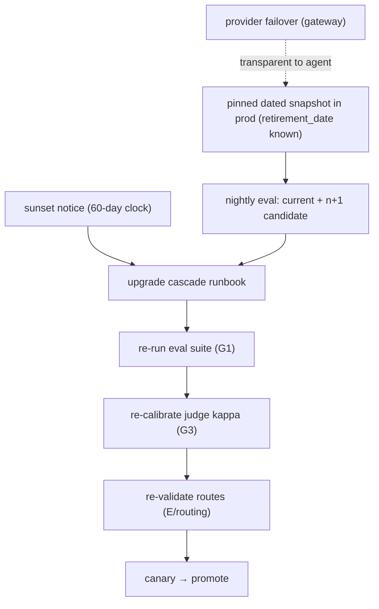

# Reference Architecture — Model Lifecycle (domain D·4)

> **Status:** v1 reference · **Family:** D · Reliability · **Tier:** CORE-LITE · **Owning phase:** P6.
> **Scope (CORE-LITE):** pin + failover + a documented **upgrade-cascade runbook**. Full
> fleet-orchestration is DEFER → P8.
> **Research note:** models live **12–18 months**; **302+** releases tracked; sunset emails on a
> **60-day clock** (Bedrock gives ~6mo). Pre-migration discipline: run the eval suite against the
> current pinned model **and the n+1 candidate continuously (nightly)** so regressions surface
> *before* the deadline, not during a panic migration. Pin **dated snapshots**
> (`claude-opus-4-5-20251101`), never rolling aliases, in prod. [TianPan deprecation treadmill;
> Anthropic snapshot-vs-alias; Bedrock model lifecycle]

## 1. Purpose
Survive the model-deprecation treadmill without instability. A new model — even a better one —
behaves differently (biases, formats, prompt sensitivity); treat every swap as a governed change.

## 2. Architecture

## 3. Coverage
- **Pinning:** dated snapshots only in prod; rolling aliases banned (they silently upgrade).
- **Continuous n+1 eval:** the candidate successor runs nightly against the eval suite *while the
  current model is in prod* — the single highest-leverage discipline here.
- **The upgrade cascade:** model swap → re-eval (G1) → re-calibrate judge kappa (G3) → re-validate
  routes (routing) → canary → promote. (This cascade is the thing almost nobody has actually operated.)
- **Provider failover:** Anthropic→Bedrock→Azure, transparent to agent code, version logged.

## 4. Metrics & thresholds
| Metric | Meaning | Target/anchor |
|---|---|---|
| prod models pinned to snapshot | no rolling aliases in prod | **100%** |
| n+1 candidate eval | candidate validated continuously | **nightly** |
| time-to-migrate on sunset | within the notice window | < 60-day clock |
| regression caught pre-deadline | vs during panic migration | tracked (the whole point) |
| failover success | provider outage handled | transparent; version logged |

## 5. Key interfaces (seam → contracts pass)
- **Model handle** `(snapshot_id, family, retirement_date)` — pinned, dated.
- **Upgrade-cascade checklist** (re-eval → judge-recal → route-revalidate → canary) as a runbook artifact.

## 6. Failure modes + how we break it (C5)
- **Rolling alias silently upgrades** → ban aliases in prod; pin dated snapshots. *Break:* point a
  call site at a rolling alias, show CI/policy rejects it.
- **Sunset panic migration** → continuous n+1 eval already has the candidate validated. *Break:*
  simulate a sunset notice, show the n+1 is green and migration is routine.
- **New model behaves differently** → canary + re-prompt; never hot-swap a frontier model untested.

## 7. SLO linkage + phase
Reliability/quality continuity. **CORE-LITE in P6** (pin + failover + runbook). Full model-fleet
orchestration **DEFER → P8** — documented, not dropped.

## 8. v1 caveats
- Model availability tracked against the litellm gateway reuse boundary; failover order is config.
- Per-tenant model overrides (regulated lane) interact with pinning — pin per (tenant, call-site).

## 9. Sources
- The model-deprecation treadmill: https://tianpan.co/blog/2026-04-27-model-deprecation-treadmill-pre-sunset-discipline
- Understanding Amazon Bedrock model lifecycle: https://aws.amazon.com/blogs/machine-learning/understanding-amazon-bedrock-model-lifecycle/
- Prompt, agent, and model lifecycle (AWS prescriptive): https://docs.aws.amazon.com/prescriptive-guidance/latest/agentic-ai-serverless/prompt-agent-and-model.html
