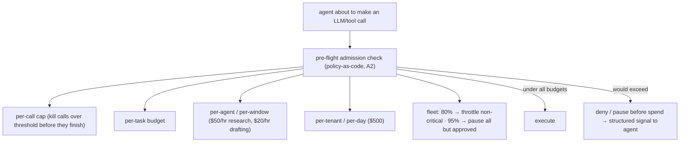

# Reference Architecture — Hierarchical Budget Admission (domain E·1)

> **Status:** v1 reference · **Family:** E · Cost · **Tier:** CORE · **Owning phase:** P5.
> **Has a science companion:** [cost-engineering-science.md](./cost-engineering-science.md).
> **Research note:** cost governance is the **runtime enforcement layer that controls what a session
> may spend *before* it terminates** — at the execution layer, independent of the agent's reasoning,
> separate from post-hoc billing. It belongs **in policy-as-code** (versioned YAML, PR-reviewed,
> enforced before execution — i.e., A2). FinOps Foundation 2026: 98% manage AI spend, only **44%
> have guardrails**; "visibility ≠ control." [Cordum Agent FinOps; Waxell; FinOps Foundation]

## 1. Purpose
Deny overspend **pre-flight**, at every level of the hierarchy, *before* tokens are spent — not a
breaker that trips after the money's gone. "Run 500 web searches" should be refused before the
first call, not discovered on the invoice.

## 2. Architecture

## 3. Coverage
- **Hierarchical budgets:** per-call → per-task → per-agent/window → per-tenant/day → fleet.
- **Pre-flight admission:** cumulative spend checked *before the next call*; session paused/terminated
  before it crosses, not after.
- **Graceful fleet degradation:** 80% → throttle non-critical agents; 95% → pause all but approved.
- **SLO3 ceilings wired in:** $5 shallow / $20 deep per run · $500/tenant/day.
- Enforced through policy-as-code (A2) — cost rules live beside security/compliance rules.

## 4. Metrics & thresholds
| Metric | Meaning | Target/anchor |
|---|---|---|
| pre-flight denial | overspend stopped *before* spend | works (not post-hoc) |
| per-run cap | shallow / deep | **$5 / $20** |
| per-tenant/day | tenant budget | **$500** (configurable) |
| fleet degradation | graceful throttle/pause | **80% throttle · 95% pause** |
| admission-check latency | overhead per call | invisible to SLO1 |

## 5. Key interfaces (seam → contracts pass)
- **Budget config hierarchy** `(call, task, agent/window, tenant/day, fleet)` thresholds + actions.
- **Admission decision** (via the PDP, A2): `allow | throttle | deny` with remaining-budget context.
- Consumes the **cost record** (see cost-engineering-science) to know cumulative spend.

## 6. Failure modes + how we break it (C5)
- **Post-hoc-only (breaker after spend)** → pre-flight admission denies *before*. *Break:* request
  500 web searches, show denial before the first call.
- **Runaway loop to the cap** → per-call cap + loop detector (D2/SLO4) trips first.
- **Fleet runaway** → 80/95% graceful degradation. *Break:* drive fleet to 95%, show non-approved
  agents paused.

## 7. SLO linkage + phase
**SLO3** directly. Built in **P5**; the cost record + budget interface freeze there for FinOps + the
flywheel.

## 8. v1 caveats
- Token *pre-estimation* (knowing a call's cost before it runs) is approximate — we cap on cumulative
  + per-call ceilings, and reconcile against actuals (cost-science); documented as a known-weak.
- Budgets enforced at the gateway + harness middleware (two points), reusing litellm where it fits.

## 9. Sources
- AI Agent Cost Governance / Agent FinOps (Cordum): https://cordum.io/blog/agent-finops-token-cost-governance
- AI Agent token budget enforcement 2026 (Waxell): https://waxell.ai/blog/ai-agent-token-budget-enforcement
- Visibility ≠ control (the $400M gap): https://www.waxell.ai/blog/ai-agent-finops-cost-enforcement
