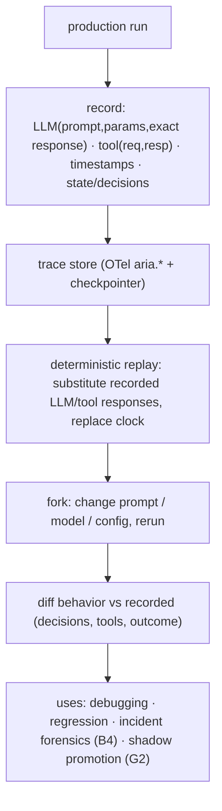

# Reference Architecture — Agent Replay + Deterministic Traces (domain F·1)

> **Status:** v1 reference · **Family:** F · Operations · **Tier:** CORE · **Owning phase:** P2.
> **Research note:** deterministic replay reconstructs an agent run step-by-step by **recording the
> non-deterministic things and substituting them verbatim** on replay: LLM calls (prompt + sampling
> params + **exact response**), tool calls (request + response — no live call on replay), and
> **timestamps** (system-clock calls replaced with recorded values). Replay is "the agent
> equivalent of unit tests, debugging, and regression." [TianPan deterministic replay; Sakura Sky;
> agent-replay (SQLite CLI)]

## 1. Purpose
Make a non-deterministic agent **debuggable, reproducible, and regression-testable**: load any
production run, replay it exactly, **fork it** to test a fix (different prompt/model/config) without
touching live systems, and **diff** behavior. Without replay, debugging, regression, and incident
investigation are all guesswork.

## 2. Architecture

## 3. Coverage
- **What's recorded** (the non-determinism sources): LLM prompt+params+**exact response**; tool
  request+response; timestamps; plus state transitions / decisions (from the checkpointer + spans).
- **Deterministic replay:** recorded responses substituted verbatim; tools mocked from recorded I/O
  (no live system); clock replaced — so the run takes the *exact* recorded path.
- **Fork-to-fix:** rerun with a changed prompt/model/config; verify the fix on a real trace.
- **Replay-as-regression:** compare the agent's internal decisions against the recorded baseline.
- **Replay-under-a-different-model:** the basis of shadow promotion (G2) and model-lifecycle n+1
  eval (D4).

## 4. Metrics & thresholds
| Metric | Meaning | Target/anchor |
|---|---|---|
| replay determinism | same recorded inputs → same path | exact (else a non-determinism source is unrecorded) |
| record coverage | LLM + tool + time + state captured | **100%** (any gap → can't replay) |
| fork-fix iteration | time to test a fix on a real trace | fast (no live deps) |
| regression-from-replay | replays in the eval regression set | grows from incidents |

## 5. Key interfaces (seam → contracts pass)
- **Trace record schema** (LLM / tool / time / state events) — the replayable unit.
- **Replay / fork API** `(run_id, overrides{model?,prompt?,config?}) → replayed run + diff`.
- Builds on the frozen **`aria.*`** OTel attributes + the **checkpointer** (A1/D1).

## 6. Failure modes + how we break it (C5)
- **Nondeterminism leaks** (replay diverges) → ensure sampling params + clock + tool I/O all
  recorded. *Break:* replay a run twice, show identical paths.
- **Incomplete record can't replay** → 100% capture asserted; a missing field fails replay loudly.
- **Replay hits a live system** → tools mocked from recorded I/O. *Break:* replay offline with all
  external deps down, show it completes.

## 7. SLO linkage + phase
Enables debugging / regression / incident forensics → supports all SLOs operationally. Built in
**P2** (on the obs plane); consumed by B4 (forensics), G1/G2 (regression/shadow), D4 (n+1 eval).

## 8. v1 caveats
- Storage of full LLM responses is large → sample + retain (errors/regulated 100%, rest sampled),
  ties cost/obs sampling.
- LangGraph's time-travel (`get_state_history`) gives *between-node* rewind; full record-replay
  (within-node LLM/tool substitution) is the additional layer we build (verify APIs at P2 per C10).

## 9. Sources
- Deterministic replay for non-deterministic agents (TianPan): https://tianpan.co/blog/2026-04-12-deterministic-replay-debugging-non-deterministic-ai-agents
- Deterministic replay (Sakura Sky, missing primitives series): https://www.sakurasky.com/blog/missing-primitives-for-trustworthy-ai-part-8/
- agent-replay (SQLite time-travel CLI): https://github.com/clay-good/agent-replay
- Best AI agent debugging tools 2026 (Braintrust): https://www.braintrust.dev/articles/best-ai-agent-debugging-tools-2026
