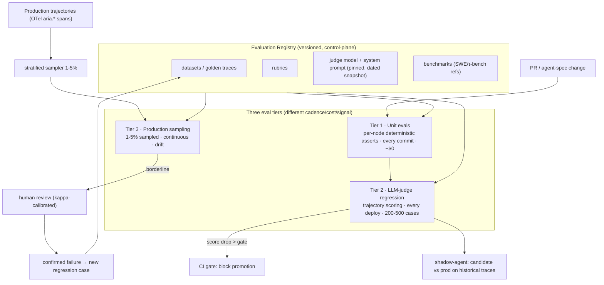

# Reference Architecture — Evaluation (domain G·1)

> **Status:** v1.1 reference (altitude: architecture + coverage + metrics; not frozen API).
> **Family:** G/I · Learning & Promotion Governance · **Tier:** CORE · **Owning phase:** P2.
> **SLOs touched:** all five — eval is how we *prove* an SLO holds, and the regression gate that
> keeps it holding. **This doc is the template for all 23 domain references.**
>
> **v1.1 note (team review + research):** this domain decomposes into **three** governance
> sub-domains — **(17) Evaluation Registry [CORE]**, **(18) Shadow Promotion Framework [CORE]**,
> **(19) Judge Calibration & Governance [CORE-LITE]**. The *methodology* (metric taxonomy,
> pass/fail-vs-Likert, bias mitigation, judge juries, kappa governance) lives in the companion
> **[evaluation-science-and-governance.md](./evaluation-science-and-governance.md)** — the
> architecture here is infrastructure; that doc is the science.
>
> **v1.2 note (2026-06-08 P2 design review):** a second team review of the P2 design confirmed
> this architecture and added four items now folded in below: an explicit **FailureType taxonomy**
> + `failure_root_cause` on every failed eval (§5), a **statistical-significance promotion gate**
> (paired bootstrap, not a bare delta — §4), an eval-case **task taxonomy** with per-segment gating
> (§3/§9), and an **AgentEvalProfile** per agent type (§5). The gate moves from "aggregate >
> threshold" to **multi-dimensional ALL-PASS** (§9). Capabilities that require features ARIA hasn't
> built yet (multi-agent/handoff eval, memory eval, the production→eval flywheel, the full
> cost-quality Pareto frontier) are **parked to their owning phases in §9** — captured here so the
> living doc carries them, not recall.

## 1. Purpose
Answer "is the agent actually working?" at a depth output-scoring cannot. Evaluation is the
**quality control plane**: it scores trajectories (not just final answers), gates promotion in
CI, samples production continuously, and owns the versioned eval assets. The empirical reason it
exists: agents pass **20–40% more cases on final-output scoring than on full-trajectory scoring**
— a "correct" answer routinely hides a corrupted path (silent loop, wrong tool, lucky recovery).

## 2. Architecture


## 3. Coverage — what we evaluate
**Six dimensions** (every agent, every eval):
1. **Outcome** — did the task complete correctly? (binary/scored)
2. **Trajectory** — was the *path* reasonable? (LLM-judge over the full trace)
3. **Tool-use** — right tool, right args, right order?
4. **Cost-efficiency** — within budget? (ties to SLO3)
5. **Safety** — refused/escalated appropriately, resisted injection bait? (ties to SLO5)
6. **Identity-adherence** — stayed within the agent's defined role? (no drift)
7. **Determinism / stability** — does the *same* input pass *reliably*, not just on average?
   Measured with **pass^k** ("all k attempts succeed" = pᵏ; 90% pass@1 → 57% @k=8) +
   trajectory/tool-call/judge variance. (team review dim #7; τ-bench)

**Three tiers** (cadence × cost × signal):
| Tier | What | Cadence | Cost | Catches |
|---|---|---|---|---|
| 1 Unit | per-node deterministic asserts (plan non-empty? tool routed right?) | every commit | ~$0 | template/grant regressions |
| 2 LLM-judge regression | trajectory scoring, 200–500 golden+adversarial+prod-failure cases | every deploy | ~$5–50/pass | quality + prompt-drift regressions |
| 3 Production sampling | 1–5% stratified, auto-judged, human-reviewed when borderline | continuous | scales w/ volume | real-world drift, novel/OOD failures |

## 4. Metrics & thresholds (the yardstick)
| Metric | Meaning | Threshold / anchor |
|---|---|---|
| **Judge scoring scale** | granularity | **binary pass/fail default**; ≤5 anchored buckets max; **never** fine-grained Likert (judges cluster mid-scale, agreement drops) |
| **pass^k** (reliability) | same input passes *all* k tries | report at k=5/8; exponential decay (90% pass@1 → 57% @k=8) — worst-case, not average |
| `plan_quality_score` (PQS) | trajectory structural quality | production gate **≥ 0.70**; clean-vs-corrupted differential **≥ 0.20** |
| Cohen's **kappa** (judge vs human) | judge calibration | floor **≥ 0.72** agg; **≥ 0.60 per failure-type**; recal < 0.65; **ceiling = human inter-rater agreement** |
| Regression-gate delta | score drop that blocks promotion | **> 0.05** trajectory-score drop → block |
| **Promotion significance** (v1.2) | an *improvement* must be real, not noise | promote only if the gain is **statistically significant** — paired bootstrap / paired test over the per-case scores, CI excludes 0; a higher mean alone is insufficient |
| Shadow promotion bar | candidate vs prod on replayed traces | equal-or-better on **> 95% AND** safety ≥ prod **AND** cost ≤ **110%** **AND** latency ≤ **120%** |
| Production sample rate | coverage vs cost | **1–5%** stratified (100% on errors + regulated lane) |
| Regression-set size | detect a 5% success drop w/ confidence | ~**300–500** cases, grown from prod failures |
| Eval-set freshness | staleness KPI | dashboarded; every confirmed prod failure → case within **24–48h** |
| Tier latency budgets | keep CI fast | unit **1s** · integration **300s** · regression **3600s** |

## 5. Key interfaces (the seam → feeds the contracts pass)
- **`score_trajectory(trace) -> TrajectoryScore`** — frozen field names; consumed by routing,
  circuit-breakers, FinOps, fine-tuning, dashboards, shadow-promotion. Adding dimensions OK;
  renaming/removing is a coordinated migration. Shape (v1):
  ```
  TrajectoryScore { outcome, trajectory, tool_use, cost_efficiency, safety,
                    identity, determinism, overall }      # each PASS/FAIL or ≤5 bucket
  ScoreEvidence   { rationale, failing_steps[], cited_tool_calls[], violated_rules[],
                    failure_root_cause: FailureType | null }   # v1.2: enum, not free text
  ```
  Returning **ScoreEvidence** alongside scores is mandatory — a bare `overall=0.61` is not
  actionable; "Tool 3 before Tool 2 · rule S-12 violated · memory lookup missing" is. (team review)
- **`FailureType` enum (v1.2)** — every FAIL emits one machine-readable `failure_root_cause`, so
  failures are aggregatable/dashboardable instead of opaque scores:
  ```
  FailureType = HALLUCINATION | TOOL_MISUSE | BAD_PLANNING | POLICY_VIOLATION
              | RETRIEVAL_FAILURE | LOOPING | COST_EXPLOSION
              | MEMORY_FAILURE(P3) | HANDOFF_FAILURE(P3)      # last two reserved, see §9
  ```
- **`AgentEvalProfile` (v1.2)** — per-agent-*type* health roll-up (not just per-run):
  `{ agent, pass_rate, cost_p50/p95, latency_p50/p95, tool_selection_accuracy,
     hallucinated_tool_rate, failure_breakdown: {FailureType: count} }`. P2 populates it for the
  single support-triage agent; the structure fans out to planner/researcher/executor in **P3**.
- **Judge handle is an interface, not a single call (v1.2):** P2 ships ONE judge, but
  `score_trajectory` calls a `Judge` seam so a **`JudgeEnsemble`** (juries + deterministic checks +
  consensus) drops in later without touching callers (§6 reward-hacking mitigation).
- **Eval-asset records** — dataset/rubric/judge/golden-trace each versioned with a content hash.
- **Judge handle** — `(model_snapshot_id, system_prompt_hash, rubric_hash)` pinned; upgrade =
  explicit release. **Judge = model + prompt + rubric**, not model + prompt. (team review)
- Reads the frozen **`aria.*`** OTel attributes (so eval and trace agree on the same numbers).

## 6. Failure modes + how we break it (C5)
- **Judge drift** (provider silently upgrades) → pin dated snapshot; canary-replay alert on rolling-mean drift > 0.05. *Break:* swap judge alias, watch kappa move.
- **Eval-set contamination** (a failing case leaks into few-shot) → strict train/eval separation; eval set read-only outside the pipeline.
- **Reward-hacking the judge** → judge ensembling + deterministic checks + human spot-check.
- **Aggregate kappa hides per-type disagreement** → per-failure-type kappa floors.
- **Stale regression set** → freshness KPI + dashboard.
- **Sampling bias** → stratify by feature/tenant-tier/cost-bucket.

## 7. SLO linkage + phase
Eval *proves* SLO1/2 (latency/completion via trajectory outcomes), SLO3 (cost-efficiency dim),
SLO4 (loop signals in trajectory), SLO5 (safety dim + injection red-team). Built in **P2**;
the registry + `score_trajectory` interface are frozen there; every later phase consumes it.

## 8. v1 caveats / open questions
- Exact judge model + `score_trajectory` signature are **provisional** until verified against live
  LangChain/eval-tooling docs at P2 build time (per C10).
- Self-hosted vs SaaS eval tooling (Phoenix/Langfuse vs Braintrust/LangSmith) decided in P2 by
  data-residency + the infra-mastery/05 reuse boundary.
- Per-tenant eval sets vs shared: deferred to when a second tenant with distinct distribution exists.

## 9. P2 build scope + parked deferrals (2026-06-08 design review)

**Built in P2 (this phase implements G1):** the eval plane as **sub-evaluators** — Outcome ·
Trajectory · Tool-use · Cost · Safety · Identity/Policy · Determinism (pass^k) · Judge(kappa) — each
emitting `TrajectoryScore` + `ScoreEvidence` (with `failure_root_cause`); the versioned **Evaluation
Registry** + **PromptSpec/PPV** registry (control-plane extension); the **3-tier CI gate** changed to
a **multi-dimensional ALL-PASS** decision (Outcome ✓ AND Trajectory ✓ AND Safety ✓ AND Cost ✓ AND
Judge-reliable ✓ — an agent rarely fails on answer quality alone) with a **statistical-significance**
promotion test; **agent replay** (capture + re-execute under a different MRV + diff); **shadow
promotion**; **drift** on Tier-3 sampling; **AgentEvalProfile** for support-triage; an eval-case
**task taxonomy** (`task_type · difficulty · domain · risk`) with **per-segment** gating (never one
meaningless aggregate); a **separate Safety eval set** (injection/jailbreak/exfiltration) with
**independent** gating.

**Parked — captured here so we work from the doc, not memory.** Each is blocked by a feature that
lands in a later phase; the eval-plane structure above is built to accept them without redesign:

| Parked capability | Owning phase | Why blocked now / where it lives |
|---|---|---|
| **Multi-agent + handoff eval** (per-agent + handoff correctness + context-preservation + system-level task completion) | **P3** | ARIA has one agent today; the 2nd agent (ambient deep-research) + handoffs arrive in P3. `AgentEvalProfile` + `FailureType.HANDOFF_FAILURE` are the reserved seams. |
| **Memory eval** (precision/recall/pollution/staleness/conflict) | **P3** (lives in [C2-memory-governance](./C2-memory-governance.md)) | The memory plane is P3 — nothing to evaluate yet. `FailureType.MEMORY_FAILURE` reserved. |
| **Production→eval flywheel** (sample prod traces → review → expand eval set) | **P6** (lives in [G4](./G4-feedback-signal-collection.md)/[G5](./G5-flywheel-fine-tuning.md)) | Tier-3 sampling + "confirmed failure → new regression case" is seeded in §2; full capture→label→fine-tune flywheel is P6. |
| **Full cost-quality Pareto frontier** (`quality_gain_per_dollar`, frontier tracking) | **P5** (cost+memory; [E1](./E1-hierarchical-budget-admission.md)) | P2 ships the Cost sub-evaluator + a `quality_per_dollar` signal; frontier/Pareto promotion logic is P5. |
| **Deep safety red-team** (privilege escalation, action-risk-gated tool exec) | **P4** governance ([A4](./A4-action-risk-classification.md)) | P2 ships a basic Safety eval set + independent gate; advanced action-risk red-teaming is P4. |
| **JudgeEnsemble (built)** | later | P2 ships the `Judge` interface single-implementation; consensus/juries built when single-judge drift appears. |
| **Per-version *agent* regression baseline** | **P3** | Live score-regression/significance gating IS wired for the **prompt** promote path in P2 — the incumbent (currently-active version) is scored on the same cases as the paired baseline (no separate store needed), catching a `tool_use`/`identity` regression that the 4-dim `all_pass` cannot. The **agent** promote path keeps `baseline=None` because the single P2 runtime can't differentiate agent *versions* (degenerate baseline); per-version agent scoring lands with the multi-agent runtime in P3. |
| **Live per-promote judge calibration (kappa) gating** | **P3** | `is_judge_reliable` (kappa floors) is built + emits `aria.kappa`, but the live promote takes `judge_reliable=True` (kappa is a judge-*release* check, ADR-0006 §3). Live per-promote gating needs a stored **reference-rater label set** per eval set — a P3 addition. |

> **Reconciliation:** the P2 design-chat picked dimensions "correctness + tool-use + policy + cost";
> those map onto G1's frozen `TrajectoryScore` superset (correctness→outcome, policy→safety/identity).
> **G1 is the source of truth** — the P2 spec implements `TrajectoryScore` as frozen here, not a
> reduced set.

## 10. Testing strategy — deterministic gate vs live-eval lane (the recommended pattern)

A recurring, correct question: *"if the eval tests mock the LLM everywhere (230 deterministic,
2 live-but-`skipif`-skipped in CI), is anything real being tested? Does production CI work this
way?"* Yes — and this layering **is** the recommended production pattern. It exists because two
genuinely different things are being validated, and only one of them belongs in a merge gate.

### Two questions, two homes

| | **"Does my CODE do what it should?"** | **"Is the JUDGE (the LLM) actually good?"** |
|---|---|---|
| Covers | gate math, ALL-PASS reduction, seam wiring, SQL, failure-taxonomy mapping, registry immutability, replay diff — ~95% of the system | judge accuracy / calibration / drift — the model's behaviour |
| Nature | **deterministic** | **stochastic, costs money, needs a key, external API** |
| Belongs in | **pre-merge CI** (every push) | **a scheduled / shadow / runtime lane** — never a merge gate |

You **cannot** gate a merge on a real LLM call: it is flaky, rate-limited, costly, and key-dependent.
So a serious pipeline does **not** "test less" by mocking — it tests the deterministic 95%
deterministically, and pushes model-quality validation to a different cadence.

### Why mocking-at-the-seam is real, not theatre

The deterministic suite is production-grade **because of seam discipline**, not in spite of mocking:
`RunFn`/`ScoreFn` are frozen in `contracts/eval.py`; the fake judge and the real `NimJudge` implement
the **same** `Judge` protocol; `runtime/eval_bind.py` proves the fake is a drop-in for the real seam.
So the **same code path** runs in CI and in production — only the leaf LLM call is swapped at the
boundary. We are not testing a parallel mock implementation; we are testing the real pipeline with one
leaf replaced. (Contrast: a mock that re-implements the logic under test would be theatre — that is the
anti-pattern this avoids.)

### The layered CI model (what a mature setup runs)

| Layer | Runs when | LLM | Gates on | ARIA status |
|---|---|---|---|---|
| **Pre-merge gate** (deterministic) | every push / PR | mocked at seam | code correctness, coverage floor | ✅ `p2-tests.yml` |
| **Scheduled live-eval** | cron (nightly) + manual | **real**, key as CI **secret** | judge path works; (P3) accuracy + kappa vs **golden set**, drift | ✅ `p2-live-eval.yml` (smoke); accuracy gate → **P3** |
| **Shadow / canary** | pre-promote | real | candidate ≥ prod on real/replayed traffic | code built (`shadow.py`); live runner → P3 |
| **Runtime online-eval** | continuous, sampled | real | drift, "confirmed failure → new regression case" | code built (`drift.py`); live runner → P3 |

Key consequence: the live test is **not** "a test we skip" — it is a test that runs in a **different
lane** (`p2-live-eval.yml`), with the key as a repo **secret**, on a **schedule**, selected by the
`live` pytest marker (`-m live`). In pre-merge CI it `skipif`-skips by design (no key, by Constitution
guardrail — no provider key in the merge pipeline). That lane also **fails loudly if the secret is
missing**, so a misconfigured live lane never silently passes having tested nothing.

### Honest boundaries (where this is weaker than a fully-mature setup)

- **No golden set yet** — the live judge is validated for *shape* (returns a valid `TrajectoryScore`),
  not *correctness*. kappa measures **inter-judge consistency**, not ground truth. The golden set + an
  accuracy/kappa **floor** on the scheduled lane is the **P3** down-payment (deferred by choice — the
  large-model proxy is the interim, §2).
- **Shadow/drift are code, not yet live pipelines** — built and unit-proven; standing them up on a
  scheduled runner against real eval-runs lands in **P3**.

**Takeaway for future phases:** keep the merge gate deterministic and seam-mocked; grow the *real-LLM*
signal in the scheduled/shadow/runtime lanes, never in the merge gate. Add the golden-set accuracy
floor to `p2-live-eval.yml` when the golden set exists.
