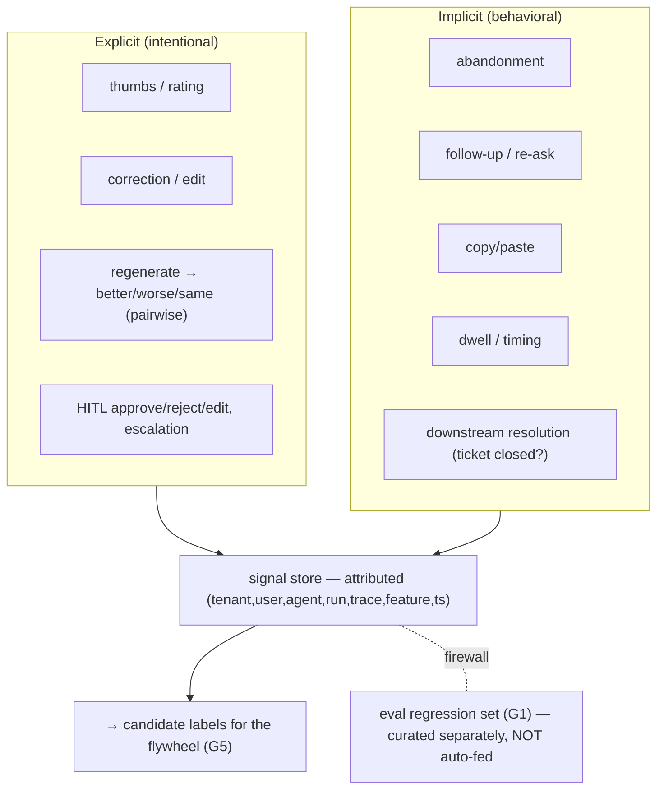

# Reference Architecture — Feedback-Signal Collection (domain G·4)

> **Status:** v1 reference · **Family:** G · Learning · **Tier:** CORE · **Owning phase:** P6.
> **Has a science companion:** [learning-loop-science.md](./learning-loop-science.md).
> **Research note:** the effective approach **combines explicit + implicit** signals — explicit
> (thumbs, ratings, corrections, the ChatGPT *regenerate → better/worse/same* pairwise prompt, HITL
> approve/reject/edit) and implicit (abandonment, follow-up/re-ask, copy/paste, dwell, tool-retry,
> downstream resolution). *Every interaction is data.* [Nebuly explicit/implicit guide; VentureBeat
> feedback loops]

## 1. Purpose
Capture the signals that tell us whether the agent actually helped — **attributed** to the run that
produced them — as the **input to the flywheel (G5)**. This is the only non-guessing path to
improvement: without it, "make it better" is a vibe; with it, it's data.

## 2. Architecture

## 3. Coverage
- **Explicit + implicit taxonomy** (above). Downstream *outcome* (did the ticket get resolved?) is
  the highest-value signal; thumbs are the noisiest.
- **Attribution:** every signal carries `(tenant, user, agent, run_id, trace_id, feature_id, ts)`.
- **Signal → label mapping** for the flywheel (G5).
- **Contamination firewall:** feedback *informs* labels, but the eval regression set (G1) stays a
  separately-curated, read-only artifact — never auto-fed from raw feedback (or evals get gamed).

## 4. Metrics & thresholds
| Metric | Meaning | Target/anchor |
|---|---|---|
| signal coverage | % runs with ≥1 signal | maximize (implicit makes this high) |
| attribution completeness | signals → a trace | **100%** |
| implicit calibration | does abandonment predict bad outcome? | measured (correlate vs outcome) |
| explicit rate | thumbs/ratings volume | tracked (sparse — supplement w/ implicit) |
| label precision | signal→label vs human label | tracked; low → recalibrate mapping |

## 5. Key interfaces (seam → contracts pass)
- **Feedback event schema** `{kind, value, run_id, trace_id, tenant, user, feature, ts}`.
- **Signal → label contract** consumed by G5; the **firewall rule** vs the eval set (G1).

## 6. Failure modes + how we break it (C5)
- **Noisy/biased explicit signals** (thumbs bias) → combine with implicit + downstream outcome.
- **Abandonment ≠ dissatisfaction** (user got the answer and left happy) → calibrate against outcome.
- **Eval contamination** → firewall; feedback never silently enters the regression set. *Break:*
  thumbs-down a run, show it's captured + attributed + a *candidate* label, and that it did **not**
  mutate the eval set.

## 7. SLO linkage + phase
Drives quality improvement (feeds every SLO via the flywheel). Built in **P6**; schema frozen for G5.

## 8. v1 caveats
- Signal→outcome calibration needs volume; v1 starts with explicit + a few high-signal implicit
  (abandonment, re-ask, downstream resolution), expands as data accrues.
- Privacy: feedback may contain PII → classified + redacted (C1).

## 9. Sources
- Explicit & implicit LLM user feedback (Nebuly): https://www.nebuly.com/blog/explicit-implicit-llm-user-feedback-quick-guide
- Designing LLM feedback loops (VentureBeat): https://venturebeat.com/ai/teaching-the-model-designing-llm-feedback-loops-that-get-smarter-over-time
