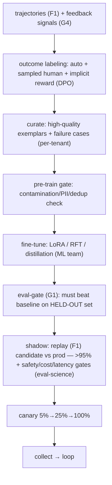

# Reference Architecture — Flywheel + Fine-Tuning (domain G·5)

> **Status:** v1 reference · **Family:** G · Learning · **Tier:** CORE · **Owning phase:** P6.
> **Has a science companion:** [learning-loop-science.md](./learning-loop-science.md).
> **Research note:** the **data flywheel** = an automated MAPE-style cycle — curate → train → deploy
> → collect → review — that turns feedback into a self-improving agent. Production proof: a routing
> step **distilled Llama-3.1-70B → fine-tuned 8B at 96% accuracy, 10× smaller, 70% faster**;
> LoRA on *curated failure samples* enables rapid iteration without full retrain. ARIA owns the
> **data plumbing + gates**; the ML team owns the training algorithm (per charter). [NVIDIA NeMo
> flywheel; Adaptive Data Flywheel arXiv:2510.27051; Agent-in-the-Loop arXiv:2510.06674]

## 1. Purpose
Close the loop: production trajectories + feedback (G4) → curated training data → eval-gated
fine-tunes (per-tenant LoRA / RFT / distillation) → shadow → canary → promote → collect again.
Improve the product from reality, not guesswork — without ever gaming the eval.

## 2. Architecture

## 3. Coverage
- **The loop stages** (capture → label → curate → gate → train → shadow → canary → collect).
- **Fine-tuning forms:** **per-tenant LoRA** (multi-LoRA serving), **RFT/RLVR** (verifiable tasks),
  **distillation** (frontier → SLM for high-volume narrow steps).
- **DPO from implicit production preferences** (abundant, low-cost — no separate reward model).
- **The decision tree** (when to fine-tune — usually *don't*; harness/context/prompt first; see
  science companion): fine-tune only if verifiable AND ≥~1000 examples AND (volume OR latency)
  justifies.
- **Eval-gate + contamination guard** (held-out verifier ≠ training verifier).

## 4. Metrics & thresholds
| Metric | Meaning | Target/anchor |
|---|---|---|
| eval-gate pass | candidate beats baseline on held-out | required to promote |
| shadow bar | candidate vs prod | >95% equal-or-better **AND** safety ≥ prod, cost ≤110%, latency ≤120% |
| distillation cost/quality | small model vs frontier | e.g., 10× smaller @ ~96% (volume-justified only, ~100k+/day) |
| contamination guard | held-out ≠ training verifier | enforced (else reward-hacked) |
| per-tenant adapter rollback | bad adapter reverted | fast; per-tenant isolation |

## 5. Key interfaces (seam → contracts pass)
- **Training-set record** (curated trajectory + label + provenance), exported (S3/MinIO).
- **Adapter handle** `(tenant, base_model, adapter_version)` for multi-LoRA serving (ties D4).
- **Eval-gate contract** (reuses G1 `score_trajectory` + shadow gates).

## 6. Failure modes + how we break it (C5)
- **Reward hacking** (gates the verifier, not the task) → held-out verifier differs from training;
  multi-objective reward (eval-science). *Break:* submit a reward-hacked candidate, show held-out
  eval blocks it.
- **Distillation amplifies teacher bias** → human spot-check + eval tests for known teacher failures.
- **LoRA mismatch on base-model upgrade** → track base per adapter; re-train on upgrade (D4).
- **Per-tenant data leakage in training** → strict per-tenant pipelines; no shared corpus; audit.
- **Catastrophic forgetting** → LoRA preserves base; eval includes general-capability checks.

## 7. SLO linkage + phase
Quality + cost (cheaper distilled models). Built in **P6**. The actual GRPO/LoRA runs are an
ML-team deliverable; ARIA owns capture, labeling, curation, gates, and serving.

## 8. v1 caveats
- v1 ships a **thin real** LoRA on a small model from curated traces (so it's actually done), not a
  full training platform; full RL/fleet training DEFER'd.
- RLVR entropy-collapse caution (narrow/confident) → validate on OOD sets (science companion).

## 9. Sources
- NVIDIA data flywheel (NeMo microservices): https://developer.nvidia.com/blog/maximize-ai-agent-performance-with-data-flywheels-using-nvidia-nemo-microservices/
- Adaptive Data Flywheel — MAPE control loops (arXiv:2510.27051): https://arxiv.org/html/2510.27051v1
- Agent-in-the-Loop data flywheel for support (arXiv:2510.06674): https://arxiv.org/html/2510.06674v2
- Bootstrapping LMs with DPO implicit rewards (arXiv:2406.09760): https://arxiv.org/pdf/2406.09760
