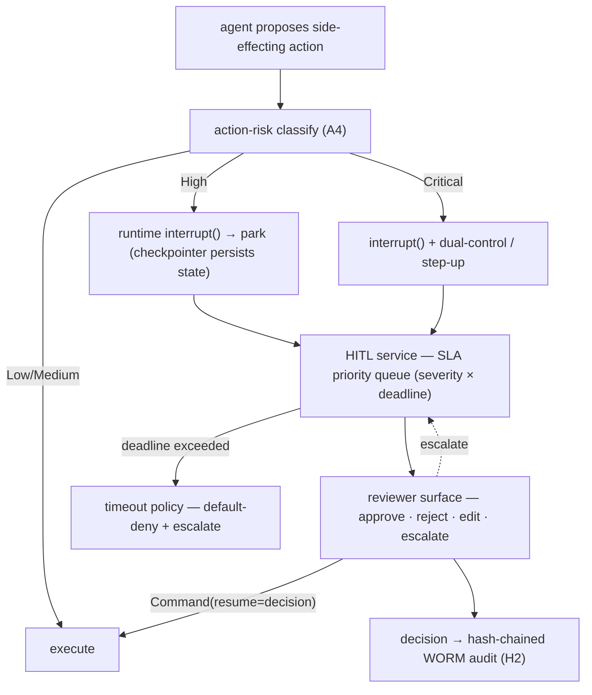

# Reference Architecture — HITL: Approval · Escalation · Resume (domain H·1)

> **Status:** v1 reference · **Family:** H · Human & Compliance · **Tier:** CORE
> **Owning phase:** P3 (HITL-at-scale) · seeded P0 (one interrupt gate in the walking skeleton).
> **The operational form of C8** ("human gates on every high-blast-radius action") and the
> technical mechanism for **EU AI Act Art 14** (human oversight: ability to intervene/stop).
> **Research note:** the mechanism converged in the ecosystem — LangGraph's `interrupt()` +
> `Command(resume=…)` (recommended over `interrupt_before/after` since Dec 2024) pauses a graph
> mid-node, **checkpoints the full state**, surfaces a decision to a human, and resumes with their
> payload. No checkpointer → no HITL: the pause/resume *is* durable execution. Art 14(5)'s "verified
> by two competent persons" is modeled as a configurable dual-control gate. [LangChain HITL; AI Act Art 14]

## 1. Purpose
Park a run at a gate when an action's blast radius demands a human, route it to the right reviewer
under an SLA, and resume *exactly where it stopped* — surviving restarts. Three gate kinds:
**approval** (proceed/abort), **review-edit** (human corrects the agent's proposed action), and
**escalation** (hand off to a senior/owner). This is the human half of action-risk (A4) and the
"complete-or-**escalate**" half of the deep SLO (SLO2).

## 2. Architecture

## 3. Coverage
- **Park/resume** via `interrupt()` + `Command(resume=…)` over the LangGraph checkpointer — the run
  is durable while parked (a crash mid-gate restores and re-presents; ties D2 durable exec).
- **SLA priority queue**: ordered by severity (A4 class) × deadline, so a parked deep run doesn't
  silently blow SLO2; bulkheaded per tenant (D2) so one tenant can't starve another's reviewers.
- **Three gate kinds** (approval / review-edit / escalation) + **dual-control** for Critical (A4
  Art 14(5) two-person path) and step-up auth.
- **Timeout/abandonment policy** — no decision by deadline → **default-deny** (never default-allow a
  High/Critical action) + escalate; notification routing (page vs queue) shares B4/D3 alert UX.

## 4. Metrics & thresholds
| Metric | Meaning | Target/anchor |
|---|---|---|
| gate coverage | High/Critical actions that actually park | **100%** (mandatory at dispatcher; bypass = SEV) |
| time-to-park | classify → interrupt persisted | sub-second |
| approval queue wait | reviewer decision latency p50/p95 | bounded so it **fits within SLO2** (deep <30 min) |
| resume-after-restart success | parked run resumes post-crash | **100%** (checkpointer is the proof) |
| timeout→default-deny rate | abandoned gates | tracked; spikes = staffing/UX issue, never auto-allow |

## 5. Key interfaces (the seam → contracts pass)
- **`HITLRequest(run_id, tenant, action, risk_class, payload_excerpt, sla_deadline, dual_control?)`** —
  the **interrupt contract** A4 names; produced by the runtime, consumed by the HITL service.
- **`HITLDecision(verdict ∈ approve|reject|edit, edited_payload?, reviewer_id, ts)`** → becomes the
  `interrupt()` return value via `Command(resume=…)`; also emitted as an explicit feedback signal (G4)
  and written to the audit chain (H2).
- **Resume boundary** — `Command(resume)` on the checkpointed thread (the durable seam).

## 6. Failure modes + how we break it (C5)
- **Reviewer never responds** → timeout → **default-deny + escalate**. *Break:* let a gate's deadline
  expire, show the action is denied (not silently executed) and re-queued to a senior.
- **Run crashes while parked** → checkpointer restore. *Break:* kill the pod mid-gate; on restart the
  run is still parked and resumes from the decision (proves SLO2's "or escalate" survives chaos).
- **Approval bypass** → the gate is mandatory at the action dispatcher; any side effect without a
  matching `HITLDecision` is a SEV (audit reconciliation catches it).
- **Queue starvation** (one tenant floods reviewers) → per-tenant bulkhead + SLA priority (D2).

## 7. SLO linkage + phase
**SLO2** directly (deep "complete-or-escalate" < 30 min — the escalate path lives here) and **C8** /
**EU AI Act Art 14**. One interrupt gate ships in the **P0** walking skeleton (single High action);
the full SLA queue + escalation + dual-control + at-scale notification mature in **P3**.

## 8. v1 caveats
- Reviewer surface is thin in v1 (CLI + minimal web); the *contract* is frozen, the UI iterates. SLA
  queue = Redis sorted-set (reuse boundary), not a bespoke workflow engine.
- Dual-control (Art 14(5)) is a **configurable capability** wired only on the Critical lane in v1 —
  ARIA is high-risk-*shaped*, so we build the control, not a claim it is legally mandated for it.

## 9. Sources
- LangGraph / LangChain human-in-the-loop (interrupt · Command · checkpointer): https://docs.langchain.com/oss/python/deepagents/human-in-the-loop
- EU AI Act Article 14 — Human Oversight: https://artificialintelligenceact.eu/article/14/
- HITL workflows with LangGraph (interrupts, approvals, async): https://www.abstractalgorithms.dev/langgraph-human-in-the-loop
