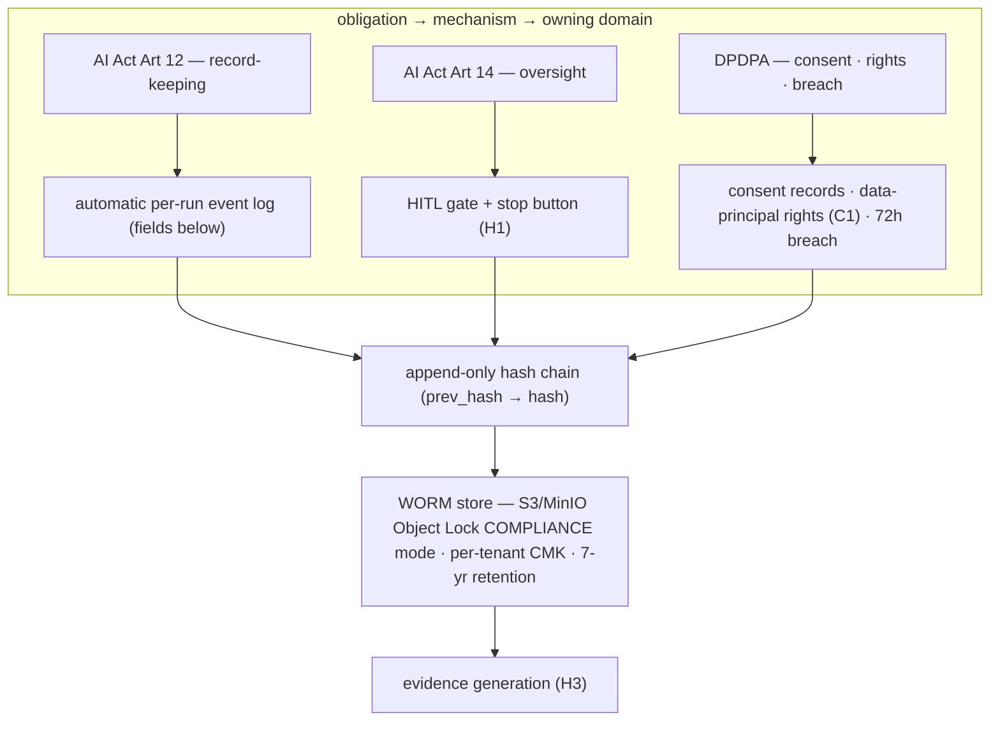

# Reference Architecture — Compliance Controls + WORM Audit (domain H·2)

> **Status:** v1 reference · **Family:** H · Human & Compliance · **Tier:** CORE
> **Owning phase:** P7 (compliance-harden) · the **WORM primitive** lands P0/P1 and is consumed by
> B4 from P2 (see §7). **The compliance backbone** C1 and B4 forward-reference.
> **Research note:** map each legal obligation to one concrete platform mechanism, not prose.
> **EU AI Act Art 12** (record-keeping): high-risk systems must *automatically log events over their
> lifetime* — start/end time of use, reference data checked, the person who verified the result.
> **Art 14**: human oversight → satisfied by HITL (H1). **India DPDP Act 2023** + **DPDP Rules 2025**
> (notified 13 Nov 2025; full compliance 13 May 2027): consent, data-principal rights, **72-hour
> breach notification**, purpose-limited retention. The evidentiary spine is a **hash-chained WORM
> log** on S3 Object Lock **compliance mode** (immutable even to root; Cohasset-assessed for SEC
> 17a-4). [EU AI Act Art 12/14; DPDP Rules 2025; AWS S3 Object Lock]

## 1. Purpose
Make the platform **demonstrably lawful**: every legal obligation we accept is wired to a mechanism
that runs, emits a signal, and produces an artifact. Not a CE-marking conformity assessment (org/legal,
DEFER) — the **technical controls** a high-risk-shaped system must ship. *This document is engineering,
not legal advice.*

## 2. Architecture

## 3. Coverage
- **Control catalog** — each obligation → mechanism → owning domain → evidence artifact (the audited
  mapping; the source of truth for "are we compliant").
- **Art 12 event log** — every run records the required fields: use start/end time, model+version,
  inputs/reference data checked, and the **verifying person** (the HITL reviewer_id from H1).
- **Hash-chained WORM audit** — append-only, `prev_hash`-linked, on Object Lock **compliance mode**;
  receives every side-effecting action (B4), HITL decision (H1), and data-subject request. **7-yr
  retention**, **per-tenant CMK** (encryption + crypto-erase; C1).
- **DPDPA lifecycle** — consent capture (purpose-bound) → withdraw → **cease + trigger erasure** (C1
  cascade); data-principal rights (access/correct/erase) and the **72h breach-notification** workflow.

## 4. Metrics & thresholds
| Metric | Meaning | Target/anchor |
|---|---|---|
| audit completeness (side-effecting) | every write + decision logged | **100%** (gap = SEV; matches B4) |
| chain/WORM immutability | tamper or delete attempt | **rejected** (hash break detected + Object Lock denies) |
| Art-12 field completeness | required log fields present per run | **100%** of required fields |
| breach-notification latency | detect → notify | **≤ 72 h** (DPDPA); SLA-monitored |
| consent-withdrawal honored | withdraw → cease + erase | proven (no processing after withdrawal) |

## 5. Key interfaces (the seam → contracts pass)
- **`AuditEntry(seq, prev_hash, hash, ts, tenant, actor, action, risk_class, decision, payload_ref)`** —
  append-only; the entry B4 "writes" and A2 means by "audit every decision (WORM)". Frozen in contracts.
- **`ConsentRecord(data_principal, purpose, granted_ts, withdrawn_ts?)`** — the DPDPA consent ledger.
- **`DataSubjectRequest(type ∈ access|correct|erase, principal) → fulfillment_ref`** — rights handler,
  routes erasure into the C1 cascade and produces a deletion-proof handle (H3).

## 6. Failure modes + how we break it (C5)
- **Audit tampered** → hash-chain break is detectable + Object Lock compliance mode blocks the write.
  *Break:* attempt to modify/delete an audit object — show the delete fails and chain-verify flags it.
- **Audit gap** (side effect with no entry) → 100% enforced at the dispatcher; reconciliation surfaces
  any gap as a SEV.
- **Consent withdrawn, processing continues** → enforcement hook ceases use + fires the erasure cascade.
  *Break:* withdraw consent mid-run, show processing halts and erasure is triggered.
- **Breach not notified in time** → 72h SLA monitor pages before the deadline.

## 7. SLO linkage + phase
Not a latency SLO — the **enterprise-readiness gate**. **Phase ordering (made explicit):** the WORM
audit *primitive* (append-only hash chain + Object Lock) ships in **P0/P1** so B4 can consume the
`audit entry (H2)` from **P2**; the *compliance controls* on top (Art-12 fields, DPDPA consent/rights/
breach, retention/CMK) harden in **P7**. "P2 depends on P7" is only the primitive depended on early,
the regulatory layer added late — not a cycle.

## 8. v1 caveats
- **High-risk-shaped, not legally classified high-risk** — ARIA isn't an Annex-III system; we build
  the Art 12/14 *technical controls* because that's the demanding bar, not because the Act binds it.
- **DPDPA**: strictest path (Significant-Data-Fiduciary-grade controls); full SDF duties (DPIA cadence,
  DPO, audits) are org-process, DEFER. WORM tooling (S3 Object Lock vs MinIO) chosen at P7 per reuse boundary.

## 9. Sources
- EU AI Act Article 12 — Record-Keeping: https://artificialintelligenceact.eu/article/12/
- DPDP Act 2023 + DPDP Rules 2025 (notified 13 Nov 2025): https://www.ey.com/en_in/insights/cybersecurity/transforming-data-privacy-digital-personal-data-protection-rules-2025
- S3 Object Lock — WORM / compliance mode (immutable backups): https://docs.aws.amazon.com/AmazonS3/latest/userguide/object-lock.html
- Tamper-proof logging (hash chains + WORM): https://pwnsentinel.org/2025/07/18/tamper-proof-logging/
