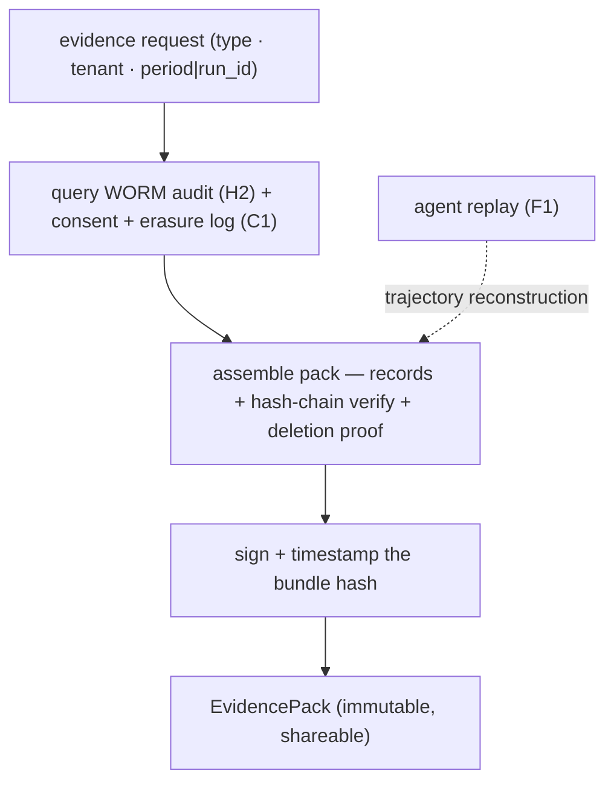

# Reference Architecture — Compliance Evidence Generation (domain H·3)

> **Status:** v1 reference · **Family:** H · Human & Compliance · **Tier:** CORE-LITE · **Owning phase:** P7.
> **Scope (CORE-LITE):** an evidence *generator* for the highest-value auditor queries, not a GRC
> product. The always-on substrate (H2 audit chain · C1 erasure log · H1 decisions) is the raw
> material; this is the **on-demand query + assembly layer** that turns it into a signed pack.
> **Research note:** the enterprise/auditor ask is concrete — *"prove tenant X's data was deleted,"*
> *"show the Art-12 log for run R,"* *"who approved this action?"* Evidence is only as good as its
> tamper-evidence: every pack carries a **hash-chain verification report** over the H2 audit, so the
> bundle proves its own integrity. [EU AI Act Art 12; DPDP right-to-erasure; immutable audit trails]

## 1. Purpose
Generate, on demand or on schedule, a **self-verifying evidence pack** for a tenant/run/period —
assembled from the WORM audit (H2), consent ledger, and erasure log (C1), bundled with a hash-chain
proof and signed. Realizes the charter **P7 demo**: *auto-generated evidence pack with deletion proof.*

## 2. Architecture

## 3. Coverage — the 5 pack types
1. **Art-12 activity log** for a run or period (the required-field log from H2).
2. **Deletion / erasure proof** — DPDPA right-to-erasure + AI Act: no residual rows/vectors, pseudonymized
   audit ref retained (the `deletion proof (H3)` C1 forward-references).
3. **Human-oversight evidence** (Art 14) — the HITL decisions, reviewer ids, dual-control records (H1).
4. **Consent trail** — grant → withdrawal lifecycle for a data principal (DPDPA).
5. **Tamper-evidence report** — hash-chain verification over the audit range (proves the pack is intact).

## 4. Metrics & thresholds
| Metric | Meaning | Target/anchor |
|---|---|---|
| pack generation time | request → signed bundle | on-demand (minutes), drill-measured |
| deletion-proof completeness | no residual data post-erasure | **0 residual** (verified against C1) |
| chain-verify included | every pack self-proves integrity | **always** (hash-chain report attached) |
| pack-type coverage | the 5 types implemented | 5/5 |

## 5. Key interfaces (seam → contracts pass)
- **`EvidenceRequest(type, tenant, period|run_id) → EvidencePack(records, hash_proof, deletion_proof?, signature, generated_ts)`** —
  the auditor-facing contract; consumes H2's `AuditEntry`, C1's erasure log, H1's `HITLDecision`.

## 6. Failure modes + how we break it (C5)
- **Incomplete evidence** (missing records) → upstream **100% audit completeness (H2)** is the
  precondition; a gap surfaces as a SEV before an auditor ever sees it.
- **Deletion proof shows residual data** → ties C1 erasure verification (row counts + vector recall =
  0). *Break:* erase tenant X, generate the pack, show no residual + pseudonymized audit ref intact.
- **Tampered evidence** → hash-chain verification + bundle signature; a broken chain fails the pack.

## 7. SLO linkage + phase
Enterprise/compliance readiness (no latency SLO). Built **CORE-LITE in P7**; this is the visible
artifact of the H2/C1 substrate. Full GRC/audit-management tooling is **DEFER**.

## 8. v1 caveats
- 5 pack types, not an exhaustive evidence catalog; signing = bundle-hash signature in v1 (not a
  notarization service).
- Depends entirely on upstream completeness — H3 *reports* compliance, it cannot *create* it; if H2/C1
  have a gap, H3 surfaces it rather than papering over it (by design).

## 9. Sources
- EU AI Act Article 12 — Record-Keeping (log content): https://artificialintelligenceact.eu/article/12/
- DPDP Act 2023 / Rules 2025 — data-principal rights incl. erasure: https://www.ey.com/en_in/insights/cybersecurity/decoding-the-digital-personal-data-protection-act-2023
- Immutable audit-trail platforms (2026): https://www.pactvera.com/best-platforms-for-immutable-audit-trails-in-2026/
