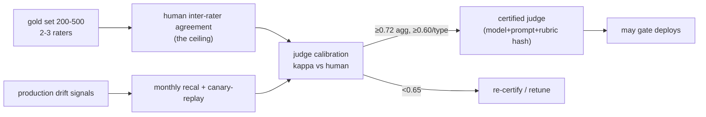

# Evaluation Science & Governance (companion to G1)

> **Status:** v1 reference (research-grounded, 2026-06). **Altitude:** methodology + metric
> taxonomy + named thresholds — the *science* of evaluation, vs the *architecture* in
> [G1-evaluation.md](./G1-evaluation.md).
> **Why it's separate:** mature platforms fail not on eval *infrastructure* (datasets, judges,
> dashboards) but on eval *methodology* — "our metrics don't predict production quality." The
> registry/traces/dashboards are infrastructure; whether the metrics reliably predict production
> behavior and business outcomes is the real differentiator, and where current industry research
> concentrates. Sources are cited inline and listed at the end.

## 0. The two non-negotiable laws (everything below follows from these)
1. **The judge is an approximation of human review, never ground truth.** Govern it like an
   instrument: calibrate, monitor drift, re-certify.
2. **A judge cannot exceed human inter-rater agreement on the task** (the *ceiling effect*). If
   human experts agree only 65% of the time, no judge reaches 80%. Measure the human ceiling
   first; it bounds every score you trust. [Judge's Verdict, arXiv:2510.09738]

---

## 1. Metric taxonomy — two axes

Metrics have **two independent axes**: *how measured* (4 layers) × *what scored* (7 dimensions).
Don't conflate them.

### Axis A — the 4 measurement layers (by trust)
| Layer | Method | Examples | Trust |
|---|---|---|---|
| **L1 Objective** | deterministic, **no judge** | success rate, tool-error rate, escalation rate, retry rate, budget-violations, latency p50/p95/p99 | **highest — gold** |
| **L2 Trajectory** | judge **pass/fail** per criterion | plan quality, tool-selection, tool-order, recovery behavior | judge-bounded |
| **L3 Outcome** | judge **pass/fail** | outcome correctness, completeness, policy compliance, safety | judge-bounded |
| **L4 Business** | downstream signal | time saved, ticket deflection, conversion/revenue impact | lagging but decisive |

**Rule:** maximize L1 (cheap, trustworthy, no judge); use judges (L2/L3) only where no
deterministic check exists; always tie back to L4 — most eval systems forget business metrics,
and they're what ultimately matter.

### Axis B — the 7 scoring dimensions (per trajectory)
outcome · trajectory · tool-use · cost-efficiency · safety · identity-adherence · **determinism**.
(Dimensions 1–6 from G1; **7 = determinism/stability**, see §6.)

---

## 2. Scoring methodology — pass/fail first (the Hamel Husain finding)

**Default to binary PASS/FAIL. Use ≤5 anchored buckets only with a per-level rubric. Never
fine-grained Likert (0–10).** Evidence:
- Hamel Husain, across 30+ companies: domain-expert **pass/fail correlates with quality better
  than granular numeric scores**, and pass/fail is harder to game with verbosity. [futureagi 2026]
- LLM judges **cluster mid-scale** — many 6s/7s on 1–10, almost no 1s/10s — collapsing
  discriminative power. [Confident AI]
- **Coarse Likert *lowers* inter-rater agreement**; issue-based rubrics are more consistent than
  one holistic Likert score. [rubric-based evals, Masood 2026]
- Why: evaluation quality is bounded by **inter-rater agreement, not score precision**. "7.14" is
  fake precision neither humans nor judges reproduce.

**The 5-bucket form (only when pass/fail is too coarse), each level anchored with an example:**
`1 Bad · 2 Weak · 3 Acceptable · 4 Good · 5 Excellent` — nothing finer.

**Make judging reliable:**
- **Rubric-based / issue-decomposed**: ask per-criterion PASS/FAIL ("1 Correct? 2 Complete?
  3 Safe?"), not "score this response." Significantly improves consistency. [Masood 2026]
- **Structured output**: return `{outcome:PASS, tool_use:FAIL, safety:PASS}` + rationale (the
  ScoreEvidence in G1), not prose-first. CoT rationale alongside the verdict moderates shallow
  heuristics. [bias mitigation 2026]
- **Pairwise > absolute for comparison.** "Which is better, A or B?" is more reliable than rating
  each — this is exactly how **shadow promotion** should compare candidate vs production.

---

## 3. LLM-as-judge improvement — the 5 biases and their mitigations

| Bias | Symptom | Mitigation |
|---|---|---|
| **Position** | slot A/B wins 10–15 pts more in pairwise | randomize order + **swap-and-average** both orderings (cost 2×, bias → ~0) |
| **Verbosity** | longer answers score higher at equal quality | length-controlled scoring (AlpacaEval-2 LC); penalize unjustified length |
| **Self-preference** | judge scores its own family 10–25% higher | benchmark **multiple judge families** vs humans; never assume the strongest API model is neutral |
| **Format** | markdown/structure sways score | symmetric formatting; instruct judge to ignore superficial features |
| **Calibration drift** | agreement decays as domains shift | §4 governance (monitor + re-certify) |
[sources: bias mitigation 2026; Self-Preference Bias arXiv:2410.21819]

**Multi-judge juries (high-risk paths).** Diverse panels — even of *weaker* models — beat a
single strong judge: an open-source panel hit **65.1%** vs GPT-4's 57.5% on AlpacaEval-2; a
3-judge jury (GPT-5.1 / DeepSeek-v3.1 / Claude Opus 4.1) reached **κ=0.82** across 1,800
evals. Aggregate by majority vote or **reliability-weighted** consensus; reserve for critical/
safety/regulated decisions (cost scales with panel size). [LLM Jury arXiv:2512.01786; orq.ai]

---

## 4. Judge calibration & governance (domain 19, CORE-LITE)

The judge is a measurement instrument; this is its maintenance program.

- **Gold set:** 200–500 hand-labeled traces per workload, **2–3 human raters** each; track
  inter-annotator agreement (this establishes the *ceiling*). [Judge's Verdict 2510.09738]
- **Kappa floors:** **≥ 0.72** aggregate, **≥ 0.60 per failure-type** (aggregate hides a judge
  that's 0.85 on easy items, 0.45 on the plan-skip items the eval exists to catch). Below **0.65 →
  do not gate deployments**; re-certify. Consider **Scott's Pi** where rater base-rates differ.
- **Drift monitoring (Judge Health):** monthly recal vs gold set + **canary-replay** on every run;
  alert on rolling-mean drift **> 0.05** (monitor the numeric score, not the categorical label —
  labels bucket too coarsely to see a 0.05 shift). New domains/workflows silently erode a judge
  that was κ=0.78 down to κ=0.58 — at which point the pipeline is *lying*.
- **Re-certification workflow:** judge change (model/prompt/rubric) → re-run gold set → must clear
  floors → versioned release. A unilateral judge swap breaks the baseline for every consumer.

---

## 5. Production dashboard catalog (the section most teams omit)

| Group | Metrics |
|---|---|
| **Reliability** | task success rate · escalation rate · retry rate · tool-failure rate · **pass^k** |
| **Quality** | outcome PASS% · trajectory PASS% · tool-use PASS% · safety PASS% · identity PASS% |
| **Cost** | cost/task · cost/tenant · token usage · budget violations |
| **Evaluation health** | judge–human **kappa** · judge **drift** · eval-set **freshness** · regression-suite size · judge **false-positive / false-negative** rate |

The *Evaluation health* group is what tells you whether the rest of the dashboard can be trusted.

---

## 6. Reliability: pass^k and "corrupt success"

- **pass^k** (τ-bench) = "all k attempts succeed" = pᵏ — captures **worst-case** reliability, the
  opposite of pass@k's "at least one." A 90%-pass@1 agent is only **57% at k=8**; SOTA tool agents
  sit **pass^8 < 25%** in retail. Agents fail as `pass pass pass FAIL pass FAIL` even at high
  average — this is dimension #7. [τ-bench arXiv:2406.12045]
- **Corrupt success**: output correct, trajectory corrupt (wrong tool, policy violation, 50× cost).
  Procedure-aware eval catches what outcome-only scoring misses — the empirical basis for
  trajectory > final answer. [arXiv:2603.03116]

---

## 7. Methodology decision rules (quick reference)
- Deterministic check exists? → **L1 objective**, no judge.
- Need a judge? → **rubric-based per-criterion PASS/FAIL**, structured output + ScoreEvidence.
- Comparing two candidates (shadow/A-B)? → **pairwise** with order-swap-average.
- High-risk / safety / regulated? → **multi-judge jury**, reliability-weighted.
- Any judge gating deploys? → must be **calibrated (κ≥0.72) and within drift** or it can't gate.
- Reliability matters (it always does)? → report **pass^k**, not just pass@1.

## 8. v1 caveats / open questions
- Exact judge model(s) chosen at P2 against live tooling docs (C10) + the infra-mastery/05 reuse
  boundary (Phoenix/Langfuse self-host vs Braintrust/LangSmith).
- Per-domain kappa floors may need raising for the regulated lane.
- Business-metric (L4) wiring depends on having real downstream signals — matures with P6 feedback.

## 9. Sources
- LLM-as-Judge Best Practices 2026 (pass/fail, mid-scale clustering, calibration): https://futureagi.com/blog/llm-as-judge-best-practices-2026
- Judge bias taxonomy & mitigation 2026: https://futureagi.com/blog/evaluating-llm-judge-bias-mitigation-2026/
- Self-Preference Bias in LLM-as-a-Judge (arXiv:2410.21819): https://arxiv.org/html/2410.21819v2
- Rubric-based evals & empirical validation (Masood, 2026): https://medium.com/@adnanmasood/rubric-based-evals-llm-as-a-judge-methodologies-and-empirical-validation-in-domain-context-71936b989e80
- Judge's Verdict — human agreement, kappa, ceiling (arXiv:2510.09738): https://arxiv.org/html/2510.09738v1
- LLM Jury-on-Demand (arXiv:2512.01786): https://arxiv.org/abs/2512.01786
- LLM juries in practice (orq.ai): https://orq.ai/blog/llm-juries-in-practice
- τ-bench — pass^k reliability (arXiv:2406.12045): https://arxiv.org/abs/2406.12045
- Corrupt success / procedure-aware eval (arXiv:2603.03116): https://arxiv.org/pdf/2603.03116
- Why pass/fail (Confident AI): https://www.confident-ai.com/blog/why-llm-as-a-judge-is-the-best-llm-evaluation-method
- Benchmarking trade-offs (Alan): https://medium.com/alan/benchmarking-ai-agents-stop-trusting-headline-scores-start-measuring-trade-offs-0fdae3a418cf
